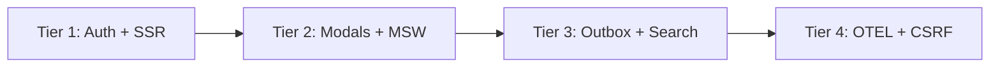
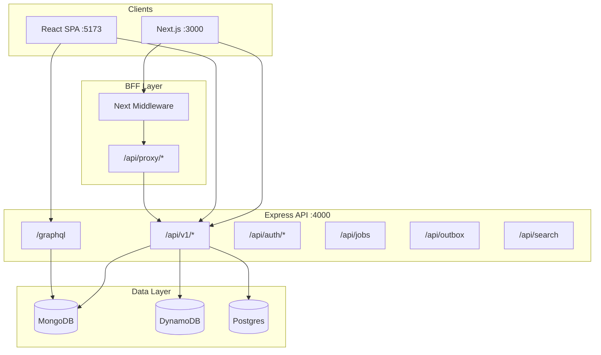

# Tiered Feature Guide — Interview Stack Guide

Master index for all six implementation tiers in the **interview-stack-guide** monorepo. Each tier builds on the previous one, moving from foundational full-stack patterns to advanced distributed architecture.

Use this document as your map: pick a tier, read the linked guide, run the demo commands, and practice the interview Q&A at the bottom of each tier file.

---

## Table of Contents

- [Quick Start](#quick-start)
- [Tier Overview](#tier-overview)
- [Master Feature Table (~60 Features)](#master-feature-table-60-features)
- [Learning Paths](#learning-paths)
- [Architecture at a Glance](#architecture-at-a-glance)
- [React vs Next.js in This Repo](#react-vs-nextjs-in-this-repo)
- [Related Documentation](#related-documentation)

---

## Quick Start

```bash
# Clone and install
cd interview-stack-guide
cp .env.example .env
npm install

# Start MongoDB
docker compose up -d mongodb

# Run all three apps (API :4000, Next.js :3000, React SPA :5173)
npm run dev
```

| Command | What it starts |
|---------|----------------|
| `npm run dev:next` | API + Next.js only |
| `npm run dev:react` | API + React SPA only |
| `npm run docker:full` | Full stack in Docker (MongoDB, Redis, API, Web) |
| `npm run test` | Vitest across all workspaces |
| `npm run test:e2e` | Playwright API E2E (auto-starts e2e server) |
| `docker compose --profile full up -d --build` | Same as docker:full with rebuild |
| `docker compose --profile messaging up -d kafka` | Tier 6 Kafka profile |
| `docker compose --profile search up -d elasticsearch` | Tier 6 Elasticsearch profile |

**Demo credentials (when `ENABLE_AUTH=true`):**

| Email | Password | Role |
|-------|----------|------|
| `admin@interview.local` | `interview123` | admin |
| `viewer@interview.local` | `interview123` | viewer |

**Key URLs:**

| URL | Description |
|-----|-------------|
| http://localhost:3000 | Next.js (SSR/ISR/App Router) |
| http://localhost:5173 | React SPA (CSR/Vite) |
| http://localhost:4000/health | API health |
| http://localhost:4000/docs | Swagger UI |
| http://localhost:4000/graphql | GraphQL playground |
| http://localhost:4000/metrics | Prometheus metrics |
| http://localhost:8080 | React SPA (Docker full profile) |

---

## Tier Overview

| Tier | Focus | Guide | Prerequisites |
|------|-------|-------|---------------|
| **1** | Foundations — auth, pagination, SSR, CI basics | [tier-1-foundations.md](./tier-1-foundations.md) | Node 20+, Docker |
| **2** | Frontend depth — TanStack Query, modals, MSW | [tier-2-frontend-depth.md](./tier-2-frontend-depth.md) | Tier 1 |
| **3** | Backend & data — Postgres, DynamoDB GSI, outbox | [tier-3-backend-data.md](./tier-3-backend-data.md) | Tier 1 |
| **4** | Observability & security — OTEL, OAuth, CSRF, CSP | [tier-4-observability-security.md](./tier-4-observability-security.md) | Tiers 1–3 |
| **5** | Infra & CI/CD — GitOps, canary, Terraform, k6 | [tier-5-infra-cicd.md](./tier-5-infra-cicd.md) | Tiers 1–4 |
| **6** | Advanced architecture — microservices, CQRS, DR | [tier-6-advanced-architecture.md](./tier-6-advanced-architecture.md) | All prior tiers |

---

## Master Feature Table (~60 Features)

| # | Feature | Tier | Primary Path(s) |
|---|---------|------|-----------------|
| 1 | JWT auth UI (React Context) | 1 | `apps/react-spa/src/context/AuthContext.tsx` |
| 2 | JWT auth UI (Next.js + cookie) | 1 | `apps/web/src/context/AuthProvider.tsx`, `apps/web/src/lib/auth.ts` |
| 3 | RBAC (admin vs viewer) | 1 | `apps/api/src/middleware/rbac.ts` |
| 4 | GraphQL mutation auth | 1 | `packages/graphql/src/resolvers.ts`, `apps/api/src/middleware/auth.ts` |
| 5 | Cursor pagination (React hook) | 1 | `apps/react-spa/src/hooks/useProducts.ts` |
| 6 | Cursor pagination (URL searchParams) | 1 | `apps/web/src/app/products/page.tsx`, `apps/web/src/components/ProductPagination.tsx` |
| 7 | Server Actions + revalidatePath | 1 | `apps/web/src/app/products/actions.ts` |
| 8 | Suspense streaming | 1 | `apps/web/src/app/products/page.tsx`, `apps/web/src/components/ProductList.tsx` |
| 9 | Frontend Vitest tests | 1 | `apps/web/src/lib/auth.test.ts`, `apps/react-spa/src/lib/auth.test.ts` |
| 10 | Dynamic routes + generateMetadata | 1 | `apps/web/src/app/products/[id]/page.tsx` |
| 11 | Shared `@interview/types` package | 1 | `packages/types/src/index.ts` |
| 12 | Swagger UI at `/docs` | 1 | `apps/api/src/app.ts` |
| 13 | API v1 versioning (`/api/v1`) | 1 | `apps/api/src/app.ts`, `apps/api/src/routes/rest.ts` |
| 14 | Next.js middleware auth | 1 | `apps/web/src/middleware.ts` |
| 15 | CSP security headers | 1 | `apps/web/src/middleware.ts` |
| 16 | BFF Route Handlers (`/api/proxy`) | 1 | `apps/web/src/app/api/proxy/[...path]/route.ts` |
| 17 | React SPA Dockerfile | 1 | `apps/react-spa/Dockerfile` |
| 18 | AWS ECS Web service (Terraform) | 1 | `infrastructure/aws/ecs.tf` |
| 19 | E2E in CI | 1 | `.github/workflows/ci.yml`, `e2e/api.spec.ts` |
| 20 | TanStack Query setup | 2 | `apps/react-spa/src/main.tsx` |
| 21 | useOptimistic demo | 2 | `apps/web/src/components/OptimisticList.tsx`, `apps/web/src/app/advanced/page.tsx` |
| 22 | React Error Boundary | 2 | `apps/react-spa/src/components/ErrorBoundary.tsx` |
| 23 | Next.js error.tsx boundary | 2 | `apps/web/src/app/products/error.tsx` |
| 24 | React.lazy code splitting | 2 | `apps/react-spa/src/components/LazyRoutes.tsx` |
| 25 | next/image on product detail | 2 | `apps/web/src/app/products/[id]/page.tsx` |
| 26 | generateStaticParams (ISR) | 2 | `apps/web/src/app/products/[id]/page.tsx` |
| 27 | Parallel/intercepting modal routes | 2 | `apps/web/src/app/products/@modal/(.)[id]/page.tsx` |
| 28 | Apollo Client setup | 2 | `apps/react-spa/src/lib/apollo.ts` |
| 29 | MSW mock handlers | 2 | `apps/react-spa/src/mocks/handlers.ts` |
| 30 | Storybook (recommended extension) | 2 | Add via `npx storybook@latest init` in `apps/react-spa` |
| 31 | Web Vitals reporter | 2 | `apps/web/src/components/WebVitalsReporter.tsx` |
| 32 | Postgres adapter | 3 | `packages/db/src/postgres-adapter.ts` |
| 33 | DynamoDB GSI Query (category-index) | 3 | `packages/db/src/dynamodb-adapter.ts`, `infrastructure/aws/dynamodb.tf` |
| 34 | Dual-write migration phases | 3 | `packages/db/src/dual-write-adapter.ts`, `apps/api/src/app.ts` |
| 35 | Idempotency keys middleware | 3 | `apps/api/src/middleware/idempotency.ts` |
| 36 | Job queue (`/api/jobs`) | 3 | `apps/api/src/routes/jobs.ts`, `apps/api/src/jobs/queue.ts` |
| 37 | Outbox pattern (`/api/outbox`) | 3 | `apps/api/src/routes/outbox.ts`, `apps/api/src/outbox/outbox.ts` |
| 38 | Search endpoint (`/api/search`) | 3 | `apps/api/src/routes/search.ts` |
| 39 | Refresh tokens (`/api/auth/refresh`) | 3 | `apps/api/src/routes/auth.ts`, `apps/api/src/middleware/auth.ts` |
| 40 | GraphQL Subscription schema | 3 | `packages/graphql/src/schema.ts` |
| 41 | OpenTelemetry tracing | 4 | `apps/api/src/telemetry.ts` |
| 42 | Grafana dashboard JSON | 4 | `infrastructure/grafana/dashboard.json` |
| 43 | Prometheus alerts | 4 | `infrastructure/prometheus/alerts.yml` |
| 44 | OAuth demo (`/oauth/demo`) | 4 | `apps/api/src/app.ts` |
| 45 | CSRF middleware | 4 | `apps/api/src/middleware/csrf.ts` |
| 46 | CSP in Next middleware | 4 | `apps/web/src/middleware.ts` |
| 47 | Secrets pattern (Terraform) | 4 | Documented in tier-4; extend `infrastructure/aws/ecs.tf` |
| 48 | GitOps ArgoCD application | 5 | `infrastructure/gitops/argocd-application.yaml` |
| 49 | Flagger canary | 5 | `infrastructure/kubernetes/canary/flagger-canary.yaml` |
| 50 | cert-manager ClusterIssuer | 5 | `infrastructure/kubernetes/cert-manager/cluster-issuer.yaml` |
| 51 | CloudFront CDN (Terraform) | 5 | `infrastructure/aws/cloudfront.tf` |
| 52 | Route53 (Terraform) | 5 | `infrastructure/aws/route53.tf` |
| 53 | Cognito (Terraform) | 5 | `infrastructure/aws/cognito.tf` |
| 54 | NetworkPolicy | 5 | `infrastructure/kubernetes/manifests/network-policy.yaml` |
| 55 | Dependabot | 5 | `.github/dependabot.yml` |
| 56 | k6 load tests | 5 | `load-tests/k6.js` |
| 57 | CI: Trivy, helm lint, terraform validate | 5 | `.github/workflows/ci.yml` |
| 58 | React SPA in docker-compose full profile | 5 | `docker-compose.yml` (profile `full`) |
| 59 | Auth microservice (`:4001`) | 6 | `services/auth-service/src/index.ts` |
| 60 | Kafka docker profile | 6 | `docker-compose.yml` (profile `messaging`) |
| 61 | Elasticsearch docker profile | 6 | `docker-compose.yml` (profile `search`) |
| 62 | Lambda Terraform scaffold | 6 | `infrastructure/aws/lambda.tf` |
| 63 | Istio VirtualService canary | 6 | `infrastructure/kubernetes/istio/virtual-service.yaml` |
| 64 | CQRS read model | 6 | `packages/events/src/cqrs-read-model.ts` |
| 65 | Pact contracts scaffold | 6 | `contracts/pact/README.md` |
| 66 | PWA manifest | 6 | `apps/web/public/manifest.json` |

---

## Learning Paths

### Weekend Sprint (8 hours)



1. **Hours 1–2:** Run `npm run dev`, explore `/products` on both `:3000` and `:5173`. Compare pagination approaches.
2. **Hours 3–4:** Enable auth, create a product via Server Action, visit `/admin`.
3. **Hours 5–6:** Read Tier 2, try intercepting modal on `/products`, enable MSW in React SPA.
4. **Hours 7–8:** Trigger dual-write scenario on `/scenarios`, run `npm run test:e2e`.

### Full-Stack Engineer (2 weeks)

| Week | Focus | Tiers | Deliverable |
|------|-------|-------|-------------|
| 1 | Frontend + API patterns | 1–2 | Explain React vs Next.js pagination in an interview |
| 2 | Data + infra | 3–5 | Deploy Helm chart, run k6 load test |

### DevOps / Platform Engineer

| Day | Tier | Task |
|-----|------|------|
| 1 | 5 | `terraform validate`, review `ecs.tf` and `cloudfront.tf` |
| 2 | 5 | Apply Helm chart, inspect NetworkPolicy |
| 3 | 5 | Walk through CI pipeline jobs |
| 4 | 6 | Kafka + Elasticsearch profiles, Istio canary YAML |
| 5 | 6 | Multi-region DR talking points |

### Role-Specific Guides

- [Frontend Engineer](../learning-paths/frontend-engineer.md)
- [Backend Engineer](../learning-paths/backend-engineer.md)
- [DevOps Engineer](../learning-paths/devops-engineer.md)
- [Full Stack](../learning-paths/full-stack.md)

---

## Architecture at a Glance



---

## React vs Next.js in This Repo

Both frontends consume the **same Express API** but demonstrate different rendering and state patterns:

| Concern | React SPA (`apps/react-spa`) | Next.js (`apps/web`) |
|---------|------------------------------|----------------------|
| Rendering | Client-side (CSR) | Server Components + SSR |
| Pagination | `useProducts` hook + component state | URL `searchParams` + Server Components |
| Auth storage | localStorage only | localStorage + `auth_token` cookie |
| Mutations | Direct API fetch from client | Server Actions + `revalidatePath` |
| Code splitting | Manual `React.lazy` | Automatic per-route |
| Error handling | Class `ErrorBoundary` | File-based `error.tsx` |
| SEO | Limited (CSR) | `generateMetadata`, `generateStaticParams` |

See [react-vs-nextjs.md](../interview-guide/react-vs-nextjs.md) for the full comparison.

---

## Related Documentation

| Document | Purpose |
|----------|---------|
| [DECISION-MATRIX.md](../DECISION-MATRIX.md) | When to pick React vs Next, Mongo vs Dynamo |
| [docker-full-demo.md](../docker-full-demo.md) | Container-only demo without Node |
| [interview-guide/](../interview-guide/) | Topic-specific Q&A |
| [MOBILE-REFERENCE.md](../MOBILE-REFERENCE.md) | Phone-friendly cheat sheet |

---

## Interview Quick-Fire (Cross-Tier)

1. **Why two frontends?** To compare CSR vs SSR in one repo — interviewers often ask when you'd pick each.
2. **Why Repository pattern?** Swap `DATA_PROVIDER` without changing API routes or GraphQL resolvers.
3. **Why BFF proxy?** Hide internal API URLs, attach server-side headers, avoid CORS in production.
4. **Why outbox pattern?** Guarantee events are published even if the message broker is temporarily down.
5. **Why dual-write?** Safe MongoDB → DynamoDB migration: write to both, validate shadow, then cut over reads.

For tier-specific Q&A with model answers, see each tier guide linked above.
