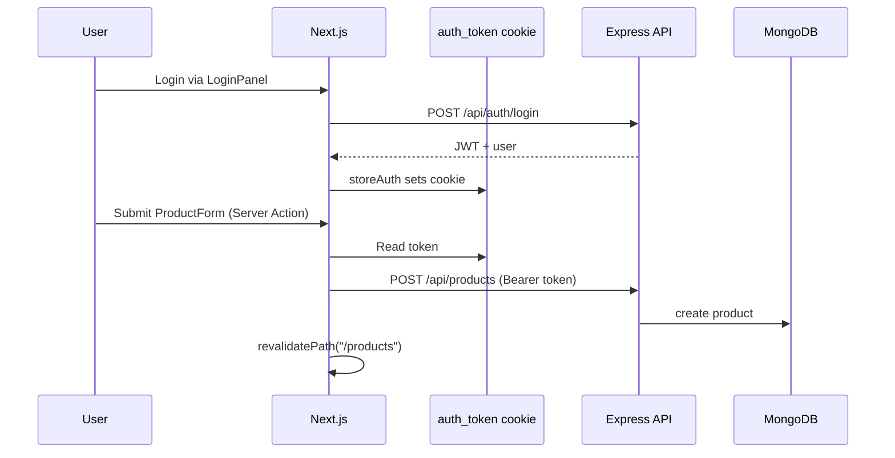
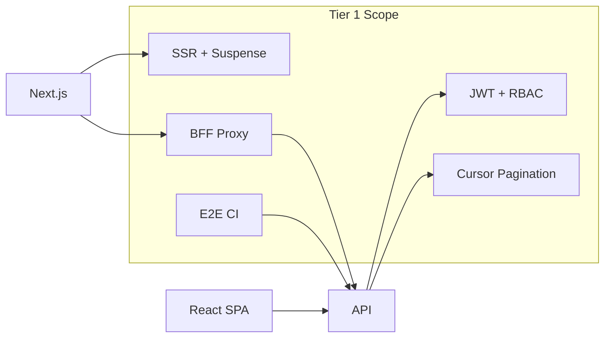

# Tier 1 — Foundations

Production-shaped fundamentals: authentication, pagination, Server Actions, SSR streaming, shared types, API versioning, middleware security, BFF patterns, containerization, and CI E2E tests.

**Prerequisites:** Node 20+, Docker, basic React and Express knowledge.

---

## Table of Contents

- [Overview](#overview)
- [Feature Table](#feature-table)
- [Architecture](#architecture)
- [Feature Deep Dives](#feature-deep-dives)
  - [JWT Auth UI](#1-jwt-auth-ui-react-context--next-cookie)
  - [RBAC](#2-rbac-admin-vs-viewer)
  - [GraphQL Mutation Auth](#3-graphql-mutation-auth)
  - [Cursor Pagination](#4-cursor-pagination-useproducts-vs-searchparams)
  - [Server Actions + revalidatePath](#5-server-actions--revalidatepath)
  - [Suspense Streaming](#6-suspense-streaming)
  - [Frontend Vitest Tests](#7-frontend-vitest-tests)
  - [Dynamic Routes + generateMetadata](#8-dynamic-routes--generatemetadata)
  - [Shared @interview/types](#9-shared-interviewtypes-package)
  - [Swagger UI](#10-swagger-ui-at-docs)
  - [API v1 Versioning](#11-api-v1-versioning)
  - [Next.js Middleware](#12-nextjs-middleware-auth--csp-headers)
  - [BFF Route Handlers](#13-bff-route-handlers-apiproxy)
  - [React SPA Dockerfile](#14-react-spa-dockerfile)
  - [AWS ECS Web Service](#15-aws-ecs-web-service-in-terraform)
  - [E2E in CI](#16-e2e-in-ci)
- [React vs Next.js Comparison](#react-vs-nextjs-comparison)
- [Runnable Demo Commands](#runnable-demo-commands)
- [Interview Q&A](#interview-qa)

---

## Overview

Tier 1 establishes the **minimum viable production stack**: two frontends sharing one API, JWT-based auth with role checks, cursor pagination in two styles, Next.js App Router patterns, and baseline CI/CD validation.



---

## Feature Table

| Feature | Path(s) | Demo URL / Command |
|---------|---------|-------------------|
| JWT auth (React Context) | `apps/react-spa/src/context/AuthContext.tsx` | http://localhost:5173 |
| JWT auth (Next + cookie) | `apps/web/src/context/AuthProvider.tsx`, `apps/web/src/lib/auth.ts` | http://localhost:3000 |
| Login UI | `apps/web/src/components/LoginPanel.tsx` | Home page header |
| RBAC middleware | `apps/api/src/middleware/rbac.ts` | `requireAdmin` on POST |
| GraphQL auth | `packages/graphql/src/resolvers.ts` | `/graphql` mutations |
| REST mutation auth | `apps/api/src/middleware/auth.ts` | `ENABLE_AUTH=true` |
| useProducts hook | `apps/react-spa/src/hooks/useProducts.ts` | `/products` on :5173 |
| searchParams pagination | `apps/web/src/app/products/page.tsx` | `/products?cursor=...` |
| ProductPagination | `apps/web/src/components/ProductPagination.tsx` | Link-based pages |
| Server Actions | `apps/web/src/app/products/actions.ts` | Product form on `/products` |
| Suspense streaming | `apps/web/src/components/ProductList.tsx` | `/products` |
| loading.tsx | `apps/web/src/app/products/loading.tsx` | Suspense fallback |
| Vitest (web) | `apps/web/src/lib/auth.test.ts` | `npm run test -w @interview/web` |
| Vitest (react-spa) | `apps/react-spa/src/lib/auth.test.ts` | `npm run test -w @interview/react-spa` |
| generateMetadata | `apps/web/src/app/products/[id]/page.tsx` | View page source |
| @interview/types | `packages/types/src/index.ts` | Imported by all apps |
| Swagger UI | `apps/api/src/app.ts` | http://localhost:4000/docs |
| OpenAPI spec | `apps/api/openapi.yaml` | http://localhost:4000/openapi.yaml |
| API v1 routes | `apps/api/src/app.ts` | `/api/v1/products` |
| REST router | `apps/api/src/routes/rest.ts` | Shared v1 + legacy |
| Next middleware | `apps/web/src/middleware.ts` | `/admin` redirect |
| BFF proxy | `apps/web/src/app/api/proxy/[...path]/route.ts` | `/api/proxy/health` |
| React Dockerfile | `apps/react-spa/Dockerfile` | `docker build -f apps/react-spa/Dockerfile .` |
| ECS Terraform | `infrastructure/aws/ecs.tf` | `terraform validate` |
| E2E tests | `e2e/api.spec.ts` | `npm run test:e2e` |
| CI workflow | `.github/workflows/ci.yml` | Push to main/develop |

---

## Architecture



---

## Feature Deep Dives

### 1. JWT Auth UI (React Context + Next Cookie)

**React SPA** uses a standard Context pattern:

```typescript
// apps/react-spa/src/context/AuthContext.tsx
export function AuthProvider({ children }) {
  const [token, setToken] = useState(() => getStoredToken());
  // login → storeAuth → localStorage
}
```

**Next.js** adds a critical bridge for Server Actions:

```typescript
// apps/web/src/lib/auth.ts
export function storeAuth(token: string, user: AuthUser): void {
  localStorage.setItem(TOKEN_KEY, token);
  document.cookie = `${AUTH_COOKIE}=${token}; path=/; max-age=3600; SameSite=Lax`;
}
```

The cookie lets Server Actions read the JWT via `cookies()` without exposing secrets to client-side fetch code paths unnecessarily.

**Demo users** (configured in `apps/api/src/config.ts`):

- `admin@interview.local` / `interview123` → role `admin`
- `viewer@interview.local` / `interview123` → role `viewer`

### 2. RBAC (admin vs viewer)

Role enforcement lives in `apps/api/src/middleware/rbac.ts`:

```typescript
export function requireRole(...roles: AuthUser["role"][]) {
  return (req, res, next) => {
    if (!roles.includes(req.user.role)) {
      return res.status(403).json({ error: "Forbidden" });
    }
    next();
  };
}
export const requireAdmin = requireRole("admin");
```

`requireAdmin` guards product **creation** in `apps/api/src/routes/rest.ts`. Viewers can read but not mutate.

### 3. GraphQL Mutation Auth

When `ENABLE_AUTH=true`, the API applies `requireMutationAuth` to GraphQL POST requests. Resolvers additionally call:

- `assertAuth(ctx, enableAuth)` — any authenticated user
- `assertAdmin(ctx, enableAuth)` — admin-only mutations

See `packages/graphql/src/resolvers.ts` for `createProduct`, `updateProduct`, `deleteProduct`.

### 4. Cursor Pagination (useProducts vs searchParams)

| Aspect | React (`useProducts`) | Next.js (`searchParams`) |
|--------|----------------------|--------------------------|
| State location | Component state (`nextCursor`) | URL query string |
| Shareable URL | No | Yes — `/products?cursor=abc&limit=5` |
| Re-fetch trigger | `loadMore()` button | Navigation / link click |
| Implementation | `apps/react-spa/src/hooks/useProducts.ts` | `apps/web/src/components/ProductPagination.tsx` |

Both call the same API: `GET /api/products?limit=5&cursor=<token>`.

### 5. Server Actions + revalidatePath

```typescript
// apps/web/src/app/products/actions.ts
"use server";
export async function createProductAction(_prev, formData) {
  const token = (await cookies()).get(AUTH_COOKIE)?.value ?? null;
  await createProductViaApi({ ... }, token);
  revalidatePath("/products");
  revalidateTag("products");
}
```

The form uses `useActionState` in `apps/web/src/components/ProductForm.tsx` — no manual `router.refresh()` needed.

### 6. Suspense Streaming

`apps/web/src/app/products/page.tsx` wraps the async `ProductList` Server Component:

```tsx
<Suspense fallback={<ProductsLoading />}>
  <ProductList limit={limit} cursor={cursor} />
</Suspense>
```

The page shell renders immediately; product data streams when the API responds. This is partial hydration — static shell, dynamic content.

### 7. Frontend Vitest Tests

| File | What it tests |
|------|---------------|
| `apps/web/src/lib/auth.test.ts` | `AUTH_COOKIE` constant, `authHeaders()` |
| `apps/web/src/app/products/actions.test.ts` | Server Action success path |
| `apps/react-spa/src/lib/auth.test.ts` | `storeAuth`, `clearAuth`, round-trip |
| `apps/react-spa/src/components/ProductForm.test.tsx` | Form rendering |

Run: `npm run test -w @interview/web` or `npm run test -w @interview/react-spa`.

### 8. Dynamic Routes + generateMetadata

`apps/web/src/app/products/[id]/page.tsx`:

- `generateStaticParams()` — pre-build top 10 product pages at build time (ISR)
- `generateMetadata()` — dynamic `<title>`, Open Graph tags per product
- `notFound()` — 404 when product missing

Contrast with React Router: `apps/react-spa/src/pages/ProductDetailPage.tsx` has no server-side metadata.

### 9. Shared @interview/types Package

`packages/types/src/index.ts` exports:

- `Product`, `AuthUser`, `PaginatedMeta`, `ApiResponse`, `AuthTokens`

All apps import from `@interview/types` — single source of truth for API contracts. Build order: types must compile before apps (`npm run build -w @interview/types`).

### 10. Swagger UI at /docs

`apps/api/src/app.ts` serves inline HTML loading Swagger UI from CDN, pointing at `/openapi.yaml`. The spec lives in `apps/api/openapi.yaml` (OpenAPI 3.0.3).

### 11. API v1 Versioning

Both routes are mounted:

```typescript
app.use("/api/v1", createRestRouter(...));
app.use("/api", createRestRouter(...));  // legacy alias
```

Prefer `/api/v1/products` in new clients. Versioning allows breaking changes on `/api/v2` later without disrupting existing consumers.

### 12. Next.js Middleware Auth + CSP Headers

`apps/web/src/middleware.ts`:

1. Sets security headers (`X-Frame-Options`, `CSP`, etc.)
2. Protects `/admin` — redirects to `/?auth=required` if `auth_token` cookie missing

Matcher excludes static assets: `/((?!_next/static|_next/image|favicon.ico).*)`.

### 13. BFF Route Handlers (/api/proxy)

`apps/web/src/app/api/proxy/[...path]/route.ts` forwards GET/POST to the Express API:

- Hides `NEXT_PUBLIC_API_URL` from browser network tab (relative path)
- Forwards `Authorization` header
- `cache: "no-store"` for fresh data

Try: `curl http://localhost:3000/api/proxy/health`

### 14. React SPA Dockerfile

Multi-stage build in `apps/react-spa/Dockerfile`:

1. **builder** — `npm ci`, `vite build`
2. **nginx:alpine** — serves `dist/` with `nginx.conf`

Exposed on port 80; docker-compose maps to `:8080` in the `full` profile.

### 15. AWS ECS Web Service in Terraform

`infrastructure/aws/ecs.tf` defines:

- ECS Fargate cluster with Container Insights
- Task definitions for API (port 4000) and Web (port 3000)
- ALB with HTTPS listener, path-based routing (`/` → web, API paths → api)
- CloudWatch log groups, deployment circuit breaker

Apply: `cd infrastructure/aws && terraform init && terraform apply`

### 16. E2E in CI

`.github/workflows/ci.yml` job `e2e-api`:

1. Depends on `lint-and-test`
2. Installs Playwright Chromium
3. Runs `npm run test:e2e`

`playwright.config.ts` auto-starts `apps/api/src/e2e-server.ts` on port 4000. Tests in `e2e/api.spec.ts` cover health, auth, validation, OpenAPI, metrics, scenarios.

---

## React vs Next.js Comparison

| Topic | React SPA | Next.js |
|-------|-----------|---------|
| **Auth** | Context + localStorage | Context + localStorage + cookie for Server Actions |
| **Pagination** | Hook state, Load More button | URL-driven, shareable links |
| **Create product** | Client fetch with token | Server Action reads cookie server-side |
| **List refresh** | Manual `refresh()` callback | Automatic via `revalidatePath` |
| **Protected routes** | Client-side route guard (optional) | Edge middleware before render |
| **Product detail SEO** | None (CSR) | `generateMetadata` + ISR |
| **Loading states** | `useState(loading)` | `Suspense` + `loading.tsx` |

**Interview tip:** "I'd use Next.js when SEO, shareable URLs, and server-side auth matter. I'd use React SPA when the app is fully authenticated, highly interactive, and deployed as static assets behind a CDN."

---

## Runnable Demo Commands

```bash
# Start everything
cp .env.example .env
docker compose up -d mongodb
npm run dev

# Enable auth for mutations
echo "ENABLE_AUTH=true" >> .env
# Restart API, then login as admin@interview.local

# Test pagination (Next.js — shareable URL)
open "http://localhost:3000/products?limit=3"

# Test pagination (React — hook state)
open http://localhost:5173/products

# Server Action create product (requires auth + admin)
# Use form at http://localhost:3000/products

# BFF proxy
curl http://localhost:3000/api/proxy/health

# Admin middleware (redirect without cookie)
curl -I http://localhost:3000/admin

# Swagger UI
open http://localhost:4000/docs

# API v1
curl "http://localhost:4000/api/v1/products?limit=2"

# Vitest
npm run test -w @interview/web
npm run test -w @interview/react-spa

# E2E
npm run test:e2e

# Build React SPA container
docker build -f apps/react-spa/Dockerfile -t interview-react-spa .

# Terraform validate
terraform -chdir=infrastructure/aws init -backend=false
terraform -chdir=infrastructure/aws validate
```

---

## Interview Q&A

### Q1: Why store JWT in both localStorage and a cookie in Next.js?

**A:** localStorage enables client-side API calls from React components. The cookie is readable by Server Actions and middleware on the server without passing tokens through props. Production often uses httpOnly cookies only — this demo uses a readable cookie to keep the auth flow visible.

### Q2: What's the difference between authentication and RBAC?

**A:** Authentication verifies *who* you are (JWT valid). RBAC verifies *what* you're allowed to do (admin vs viewer). A viewer can authenticate successfully but still get 403 on POST `/api/products`.

### Q3: Why cursor pagination instead of offset?

**A:** Offset pagination (`OFFSET 1000`) degrades on large datasets — the DB must scan skipped rows. Cursor pagination uses an opaque token tied to the last seen item, giving stable O(1) reads. Trade-off: you can't jump to page 47 directly.

### Q4: What does revalidatePath do vs router.refresh()?

**A:** `revalidatePath("/products")` invalidates the Next.js Data Cache for that path. The next request re-fetches Server Components. `router.refresh()` is the client trigger. Server Actions call `revalidatePath` server-side — no client code needed.

### Q5: Why a BFF proxy instead of calling the API directly?

**A:** (1) Hide internal service URLs, (2) attach server-side secrets/headers, (3) simplify CORS in production, (4) enable request shaping/logging at the edge. The browser calls same-origin `/api/proxy/*`.

### Q6: How does Suspense streaming improve UX?

**A:** The HTML shell (header, form, layout) arrives immediately. The product list streams in when data is ready. Users see structure instantly instead of a blank page waiting for all data.

### Q7: Why mount both /api and /api/v1?

**A:** Backward compatibility. Existing clients keep using `/api/products`. New clients adopt `/api/v1/products`. When v2 ships, v1 remains stable for consumers who haven't migrated.

---

**Next:** [Tier 2 — Frontend Depth](./tier-2-frontend-depth.md) | [Back to index](./README.md)
