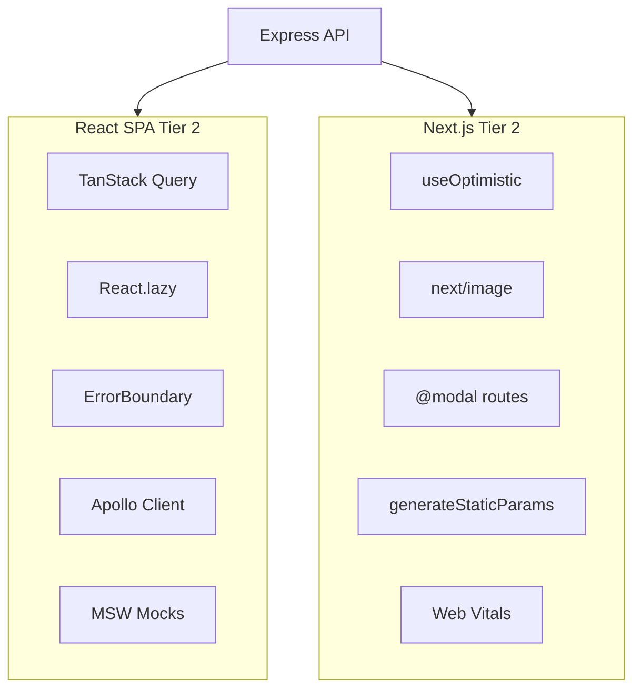
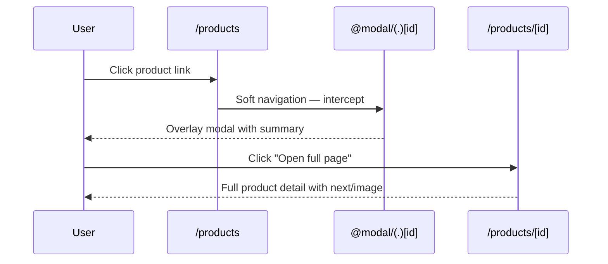
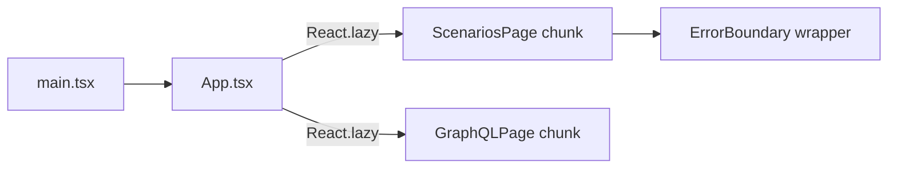

# Tier 2 — Frontend Depth

Advanced React and Next.js patterns: TanStack Query, optimistic UI, error boundaries, code splitting, image optimization, static generation, parallel/intercepting routes, Apollo Client, MSW mocking, Storybook guidance, and Web Vitals monitoring.

**Prerequisites:** [Tier 1 — Foundations](./tier-1-foundations.md)

---

## Table of Contents

- [Overview](#overview)
- [Feature Table](#feature-table)
- [Architecture](#architecture)
- [Feature Deep Dives](#feature-deep-dives)
  - [TanStack Query Setup](#1-tanstack-query-setup)
  - [useOptimistic Demo](#2-useoptimistic-demo)
  - [Error Boundaries](#3-react-error-boundary-vs-next-errortsx)
  - [React.lazy Code Splitting](#4-reactlazy-code-splitting)
  - [next/image](#5-nextimage-on-product-detail)
  - [generateStaticParams](#6-generatestaticparams)
  - [Parallel/Intercepting Modal Routes](#7-parallelintercepting-modal-routes-modal)
  - [Apollo Client Setup](#8-apollo-client-setup)
  - [MSW Mock Handlers](#9-msw-mock-handlers)
  - [Storybook](#10-storybook)
  - [Web Vitals Reporter](#11-web-vitals-reporter)
- [React vs Next.js Comparison](#react-vs-nextjs-comparison)
- [Runnable Demo Commands](#runnable-demo-commands)
- [Interview Q&A](#interview-qa)

---

## Overview

Tier 2 explores **how each frontend framework handles advanced UX concerns**: caching, optimistic updates, error recovery, bundle splitting, SEO/static generation, modal routing, GraphQL client setup, and performance measurement.



---

## Feature Table

| Feature | Path(s) | Demo |
|---------|---------|------|
| TanStack Query provider | `apps/react-spa/src/main.tsx` | React SPA any page |
| QueryClient config | `apps/react-spa/src/main.tsx` | Default staleTime/cache |
| useOptimistic demo | `apps/web/src/components/OptimisticList.tsx` | http://localhost:3000/advanced |
| Advanced page | `apps/web/src/app/advanced/page.tsx` | Tier 2 overview |
| React ErrorBoundary | `apps/react-spa/src/components/ErrorBoundary.tsx` | Wrap lazy routes |
| Next error.tsx | `apps/web/src/app/products/error.tsx` | Trigger API failure |
| React.lazy routes | `apps/react-spa/src/components/LazyRoutes.tsx` | `/scenarios`, `/graphql` |
| next/image | `apps/web/src/app/products/[id]/page.tsx` | `/products/:id` |
| generateStaticParams | `apps/web/src/app/products/[id]/page.tsx` | `next build` output |
| Parallel modal layout | `apps/web/src/app/products/layout.tsx` | `@modal` slot |
| Intercepting route | `apps/web/src/app/products/@modal/(.)[id]/page.tsx` | Click product link |
| Modal default | `apps/web/src/app/products/@modal/default.tsx` | Empty slot fallback |
| Apollo Client | `apps/react-spa/src/lib/apollo.ts` | GraphQL page |
| GET_PRODUCTS query | `apps/react-spa/src/lib/apollo.ts` | Inline query string |
| MSW handlers | `apps/react-spa/src/mocks/handlers.ts` | `VITE_ENABLE_MSW=true` |
| MSW bootstrap | `apps/react-spa/src/mocks/handlers.ts` | `enableMocking()` in main |
| Web Vitals | `apps/web/src/components/WebVitalsReporter.tsx` | Dev console logs |
| Layout integration | `apps/web/src/app/layout.tsx` | `<WebVitalsReporter />` |
| Patterns reference | `apps/web/src/app/patterns/page.tsx` | Pattern catalog |
| React patterns page | `apps/react-spa/src/pages/PatternsPage.tsx` | Side-by-side paths |

---

## Architecture

### Intercepting Modal Flow



### Code Splitting (React SPA)



---

## Feature Deep Dives

### 1. TanStack Query Setup

`apps/react-spa/src/main.tsx` wraps the app:

```tsx
const queryClient = new QueryClient();

<QueryClientProvider client={queryClient}>
  <BrowserRouter>
    <App />
  </BrowserRouter>
</QueryClientProvider>
```

**Why TanStack Query in React but not Next.js?**

- React SPA has no server cache — TanStack Query provides client-side caching, deduplication, background refetch, and stale-while-revalidate.
- Next.js Server Components fetch on the server with built-in caching (`fetch` cache, `revalidatePath`). Adding TanStack Query would duplicate concerns.

**Production extensions:** Configure `staleTime`, `gcTime`, query keys per resource, optimistic updates via `useMutation`.

### 2. useOptimistic Demo

`apps/web/src/components/OptimisticList.tsx` uses React 19's `useOptimistic`:

```tsx
const [items, setItems] = useOptimistic(initial);
const [pending, startTransition] = useTransition();

function addItem() {
  startTransition(async () => {
    setItems([...items, { id: crypto.randomUUID(), name: "New item" }]);
    await new Promise((r) => setTimeout(r, 800)); // simulated latency
  });
}
```

Visit http://localhost:3000/advanced to see instant UI updates before server confirmation. This pattern applies to likes, cart additions, and todo items.

### 3. React Error Boundary vs Next error.tsx

| Aspect | React `ErrorBoundary` | Next.js `error.tsx` |
|--------|----------------------|---------------------|
| Location | `apps/react-spa/src/components/ErrorBoundary.tsx` | `apps/web/src/app/products/error.tsx` |
| Mechanism | Class component, `componentDidCatch` | File convention, wraps route segment |
| Scope | Wrap any subtree (e.g., lazy routes) | Entire `/products` segment |
| Recovery | Custom retry button resets state | `reset()` re-renders segment |
| SSR | Client-only | Works with Server Components |

**When to use which:** React Error Boundaries catch render errors in client components. Next.js `error.tsx` additionally integrates with the App Router segment hierarchy — a child route error doesn't crash the root layout.

### 4. React.lazy Code Splitting

`apps/react-spa/src/components/LazyRoutes.tsx`:

```tsx
export const LazyScenariosPage = lazy(() => import("../pages/ScenariosPage"));
export const LazyGraphQLPage = lazy(() => import("../pages/GraphQLPage"));

export function LazyRoute({ children }) {
  return <Suspense fallback={<p>Loading route chunk…</p>}>{children}</Suspense>;
}
```

Next.js splits automatically per `page.tsx` — no manual lazy imports needed. Compare bundle sizes: React requires explicit splitting for infrequent routes.

### 5. next/image on Product Detail

`apps/web/src/app/products/[id]/page.tsx`:

```tsx
<Image
  src={`https://placehold.co/120x120/...`}
  alt={product.name}
  width={120}
  height={120}
/>
```

Benefits: automatic lazy loading, responsive sizing, WebP conversion (in production), layout shift prevention via explicit dimensions. React SPA would use `` or a manual lazy-load library.

### 6. generateStaticParams

Pre-renders product pages at build time:

```tsx
export async function generateStaticParams() {
  const result = await fetchProductsPaginated({ limit: 10 });
  return result.items.map((p) => ({ id: p.id }));
}
```

Combined with `generateMetadata`, each product gets static HTML + SEO tags. Unknown IDs fall back to dynamic rendering (ISR on-demand).

Run `npm run build -w @interview/web` and inspect `.next/server/app/products/[id]/`.

### 7. Parallel/Intercepting Modal Routes (@modal)

File structure:

```
apps/web/src/app/products/
├── layout.tsx              # Renders {children} + {modal}
├── page.tsx                # Product list
├── [id]/page.tsx           # Full product page
└── @modal/
    ├── default.tsx         # null when no modal
    └── (.)[id]/page.tsx    # Intercepts soft navigation
```

`(.)` intercepts same-level routes. Clicking a product on `/products` opens the modal overlay; direct navigation to `/products/abc` shows the full page.

`layout.tsx`:

```tsx
export default function ProductsLayout({ children, modal }) {
  return (<>{children}{modal}</>);
}
```

### 8. Apollo Client Setup

`apps/react-spa/src/lib/apollo.ts`:

```tsx
export const apolloClient = new ApolloClient({
  link: new HttpLink({ uri: `${API_URL}/graphql` }),
  cache: new InMemoryCache(),
});
```

Includes a sample `GET_PRODUCTS` query. The GraphQL demo page executes this against the shared Apollo Server.

Next.js could use Apollo Client similarly in Client Components, but Server Components typically use direct `fetch` to `/graphql` — simpler, no client bundle cost.

### 9. MSW Mock Handlers

`apps/react-spa/src/mocks/handlers.ts`:

```typescript
export async function enableMocking() {
  if (import.meta.env.VITE_ENABLE_MSW !== "true") return;
  const worker = setupWorker(...handlers);
  await worker.start({ onUnhandledRequest: "bypass" });
}
```

Handlers mock `/health` and `/api/products` with fixture data. Enable with:

```bash
VITE_ENABLE_MSW=true npm run dev -w @interview/react-spa
```

**Use cases:** Frontend development without API, Storybook stories, deterministic tests.

### 10. Storybook

Storybook is **not pre-installed** but is the natural companion to MSW for isolated component development.

**Recommended setup:**

```bash
cd apps/react-spa
npx storybook@latest init
```

Create stories for:

- `ProductForm` (with MSW handler for POST)
- `ErrorBoundary` (trigger error via story arg)
- `OptimisticList` (Next.js — copy to web or story in isolation)

**Interview talking point:** Storybook documents component states (loading, error, empty) independent of routing and API availability.

### 11. Web Vitals Reporter

`apps/web/src/components/WebVitalsReporter.tsx`:

```tsx
"use client";
export function WebVitalsReporter() {
  useReportWebVitals((metric) => {
    if (process.env.NODE_ENV === "development") {
      console.log(JSON.stringify({ webVital: metric.name, value: metric.value }));
    }
  });
  return null;
}
```

Mounted in root `layout.tsx`. Metrics: **LCP** (Largest Contentful Paint), **FID/INP** (interactivity), **CLS** (layout shift).

Production: POST metrics to analytics endpoint or OpenTelemetry collector.

---

## React vs Next.js Comparison

| Concern | React SPA | Next.js |
|---------|-----------|---------|
| **Data caching** | TanStack Query | Server fetch cache + revalidatePath |
| **Optimistic UI** | Manual state or TanStack Query mutation | `useOptimistic` + Server Actions |
| **Code splitting** | Manual `React.lazy` | Automatic per route |
| **Images** | `` or third-party | `next/image` optimized |
| **Static pages** | Not applicable (CSR) | `generateStaticParams` + ISR |
| **Modals** | React Router nested routes | Parallel + intercepting routes |
| **GraphQL** | Apollo Client (client bundle) | Server fetch or Apollo in Client Components |
| **API mocking** | MSW in Vite | MSW possible; often use API directly in dev |
| **Performance monitoring** | Manual web-vitals library | Built-in `useReportWebVitals` |
| **Error recovery** | ErrorBoundary class | File-based `error.tsx` per segment |

---

## Runnable Demo Commands

```bash
# Start dev servers
npm run dev

# useOptimistic demo
open http://localhost:3000/advanced

# Intercepting modal — click a product on list (soft nav)
open http://localhost:3000/products

# Full product page with next/image
open http://localhost:3000/products/demo-1

# Enable MSW in React SPA
VITE_ENABLE_MSW=true npm run dev -w @interview/react-spa
# Products page shows "MSW Mock Product"

# Lazy-loaded routes (check Network tab for chunk files)
open http://localhost:5173/scenarios
open http://localhost:5173/graphql

# Trigger Next.js error boundary — stop API, visit /products
# Shows error.tsx with Retry button

# Web Vitals — open DevTools console on Next.js home page
open http://localhost:3000

# Build to inspect static params
npm run build -w @interview/web

# BFF proxy from advanced page context
curl http://localhost:3000/api/proxy/health

# Patterns catalog (both apps)
open http://localhost:3000/patterns
open http://localhost:5173/patterns
```

---

## Interview Q&A

### Q1: When would you choose TanStack Query over Server Components?

**A:** TanStack Query excels in client-heavy SPAs needing real-time cache invalidation, optimistic mutations, and infinite scroll without full page reloads. Server Components excel when data is read-heavy, SEO matters, and you want zero client JS for data fetching.

### Q2: What is useOptimistic and how differs from optimistic TanStack Query mutations?

**A:** `useOptimistic` is a React primitive that shows temporary UI state during a transition. TanStack Query's optimistic updates manipulate cache data with rollback on error. Both solve "feel instant" UX; `useOptimistic` pairs naturally with Server Actions in Next.js.

### Q3: Explain intercepting routes vs parallel routes.

**A:** **Parallel routes** (`@modal` slot) render multiple pages in the same layout simultaneously. **Intercepting routes** (`(.)[id]`) replace what would render on soft navigation while preserving the URL. Together they create modal-over-list UX without losing context.

### Q4: Why use MSW instead of mocking fetch in tests?

**A:** MSW intercepts at the network layer — the same code path runs in dev, test, and Storybook. No need to inject mock functions or change import paths. Handlers are reusable across environments.

### Q5: What are Core Web Vitals and why monitor them?

**A:** LCP measures loading performance, INP measures responsiveness, CLS measures visual stability. Google uses them for search ranking signals. Monitoring in production catches regressions from new features or third-party scripts.

### Q6: How does next/image prevent layout shift?

**A:** Explicit `width` and `height` (or `fill` with sized container) reserve space before the image loads. The browser knows aspect ratio upfront, preventing content jumping (low CLS).

### Q7: What's the trade-off of generateStaticParams with dynamic inventory?

**A:** Pre-building 10 products is fast; pre-building 100,000 is not. Use ISR — pre-build popular items, generate others on first request with revalidation interval. This repo pre-builds top 10 as a demo.

---

**Previous:** [Tier 1 — Foundations](./tier-1-foundations.md) | **Next:** [Tier 3 — Backend & Data](./tier-3-backend-data.md) | [Index](./README.md)
