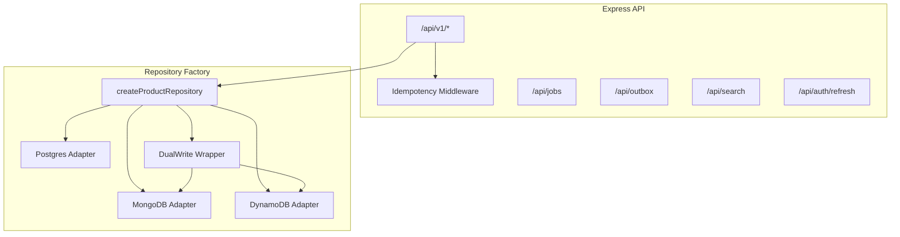
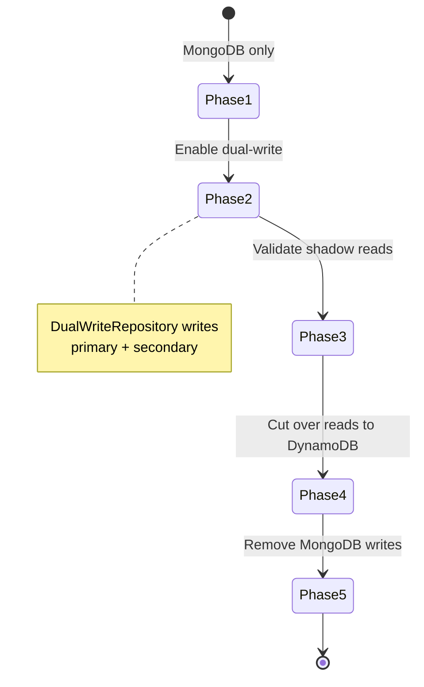
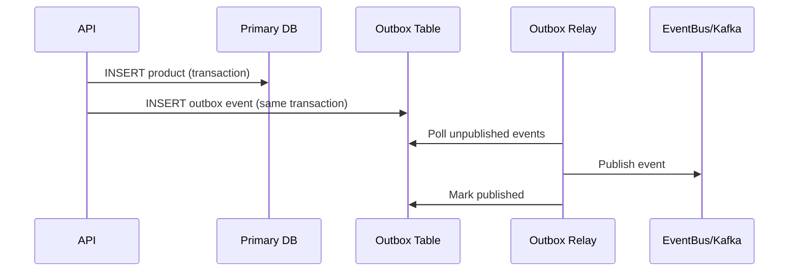

# Tier 3 — Backend & Data

Data layer depth: Postgres adapter, DynamoDB GSI queries, dual-write migration, idempotency keys, job queues, transactional outbox, search, refresh tokens, GraphQL subscriptions, and API v1 routes.

**Prerequisites:** [Tier 1 — Foundations](./tier-1-foundations.md)

---

## Table of Contents

- [Overview](#overview)
- [Feature Table](#feature-table)
- [Architecture](#architecture)
- [Feature Deep Dives](#feature-deep-dives)
  - [Postgres Adapter](#1-postgres-adapter-data_providerpostgres)
  - [DynamoDB GSI Query](#2-dynamodb-gsi-query-category-index)
  - [Dual-Write Migration](#3-dual-write-migration-phases)
  - [Idempotency Keys](#4-idempotency-keys-middleware)
  - [Job Queue](#5-job-queue-apijobs)
  - [Outbox Pattern](#6-outbox-pattern-apioutbox)
  - [Search Endpoint](#7-search-endpoint-apisearch)
  - [Refresh Tokens](#8-refresh-tokens-apiauthrefresh)
  - [GraphQL Subscriptions](#9-graphql-subscription-schema)
  - [API v1 Routes](#10-api-v1-routes)
- [React vs Next.js Comparison](#react-vs-nextjs-comparison)
- [Runnable Demo Commands](#runnable-demo-commands)
- [Interview Q&A](#interview-qa)

---

## Overview

Tier 3 focuses on **backend reliability and data portability**. The Repository pattern in `packages/db` lets you swap MongoDB, DynamoDB, or Postgres via `DATA_PROVIDER`. Surrounding patterns — idempotency, outbox, job queue — demonstrate production-grade API design.



---

## Feature Table

| Feature | Path(s) | Env / Trigger |
|---------|---------|---------------|
| Repository factory | `packages/db/src/index.ts` | `DATA_PROVIDER` |
| Postgres adapter | `packages/db/src/postgres-adapter.ts` | `DATA_PROVIDER=postgres` |
| MongoDB adapter | `packages/db/src/mongodb-adapter.ts` | `DATA_PROVIDER=mongodb` |
| DynamoDB adapter | `packages/db/src/dynamodb-adapter.ts` | `DATA_PROVIDER=dynamodb` |
| DynamoDB GSI (Terraform) | `infrastructure/aws/dynamodb.tf` | `category-index` |
| Dual-write adapter | `packages/db/src/dual-write-adapter.ts` | Scenario trigger |
| Dual-write wiring | `apps/api/src/app.ts` | `simulator.isDualWriteActive()` |
| Idempotency middleware | `apps/api/src/middleware/idempotency.ts` | `Idempotency-Key` header |
| Job queue core | `apps/api/src/jobs/queue.ts` | In-process demo |
| Jobs router | `apps/api/src/routes/jobs.ts` | `/api/jobs` |
| Outbox store | `apps/api/src/outbox/outbox.ts` | In-memory |
| Outbox router | `apps/api/src/routes/outbox.ts` | `/api/outbox` |
| Outbox on create | `apps/api/src/routes/rest.ts` | `appendOutbox()` |
| Search router | `apps/api/src/routes/search.ts` | `/api/search?q=` |
| Refresh token store | `apps/api/src/middleware/auth.ts` | In-memory Map |
| Refresh endpoint | `apps/api/src/routes/auth.ts` | `POST /api/auth/refresh` |
| GraphQL schema | `packages/graphql/src/schema.ts` | `Subscription` type |
| GraphQL resolvers | `packages/graphql/src/resolvers.ts` | Query/Mutation |
| REST v1 mount | `apps/api/src/app.ts` | `/api/v1` |
| Shared types | `packages/types/src/index.ts` | `AuthTokens` |
| Validation schemas | `packages/validation/src/schemas.ts` | Zod |
| Config loader | `apps/api/src/config.ts` | All env vars |

---

## Architecture

### Dual-Write Migration Phases



### Outbox Pattern Flow



---

## Feature Deep Dives

### 1. Postgres Adapter (DATA_PROVIDER=postgres)

`packages/db/src/postgres-adapter.ts`:

```typescript
export class PostgresProductRepository extends MockProductRepository {
  static async connect(connectionString?: string): Promise<PostgresProductRepository> {
    if (connectionString) {
      console.log(JSON.stringify({ level: "info", message: "Postgres adapter ready" }));
    }
    return new PostgresProductRepository();
  }
}
```

Factory in `packages/db/src/index.ts`:

```typescript
case "postgres": {
  return PostgresProductRepository.connect(config.postgresUri);
}
```

**Interview note:** This demo uses in-memory fallback. Production would use `pg.Pool` with parameterized queries, connection pooling, and migrations (Flyway/Liquibase).

**SQL vs NoSQL trade-offs:**

| Postgres | MongoDB/DynamoDB |
|----------|------------------|
| ACID transactions, JOINs | Flexible schema, horizontal scale |
| Complex queries | Denormalized access patterns |
| Vertical + read replicas | DynamoDB on-demand scaling |

### 2. DynamoDB GSI Query (category-index)

When filtering by category, the adapter uses Query instead of Scan:

```typescript
// packages/db/src/dynamodb-adapter.ts
new QueryCommand({
  TableName: this.tableName,
  IndexName: "category-index",
  KeyConditionExpression: "category = :cat",
  ExpressionAttributeValues: { ":cat": filter.category },
})
```

Terraform defines the GSI in `infrastructure/aws/dynamodb.tf`:

```hcl
global_secondary_index {
  name            = "category-index"
  hash_key        = "category"
  projection_type = "ALL"
}
```

**Why GSI?** Scan reads every item — O(n) cost. GSI Query reads only matching partition — O(log n) + result size. Critical at scale.

### 3. Dual-Write Migration Phases

`packages/db/src/dual-write-adapter.ts` wraps primary + secondary repositories:

```typescript
async create(input: CreateProductInput) {
  const product = await this.primary.create(input);
  try {
    await this.secondary.create({ ...input, name: product.name });
    this.onSecondaryWrite?.("create", { productId: product.id, target: "secondary" });
  } catch (err) {
    this.onSecondaryWrite?.("create", { productId: product.id, error: String(err) });
  }
  return product;
}
```

Activated via scenario simulator in `apps/api/src/app.ts`:

```typescript
if (simulator.isDualWriteActive()) {
  return new DualWriteRepository(repo!, shadowRepo, callback);
}
```

Trigger on `/scenarios` page: **migration_dual_write** scenario.

**Migration playbook:**

1. **Phase 1:** MongoDB only (current default)
2. **Phase 2:** Dual-write — primary MongoDB, shadow DynamoDB
3. **Phase 3:** Compare counts, spot-check shadow data
4. **Phase 4:** Flip reads to DynamoDB, MongoDB still receives writes
5. **Phase 5:** DynamoDB only, decommission MongoDB

### 4. Idempotency Keys Middleware

`apps/api/src/middleware/idempotency.ts`:

- Applies to POST requests with `Idempotency-Key` header
- Fingerprints: `sha256(key + path + body)`
- Returns cached response if key seen within 24h TTL

```bash
curl -X POST http://localhost:4000/api/products \
  -H "Content-Type: application/json" \
  -H "Idempotency-Key: order-123" \
  -H "Authorization: Bearer $TOKEN" \
  -d '{"name":"Widget","description":"Test","price":9.99,"category":"tools"}'
```

Repeat the same request — identical response, no duplicate product.

**Production:** Store in Redis or DynamoDB with TTL; essential for payment APIs and retry-safe webhooks.

### 5. Job Queue (/api/jobs)

In-process queue in `apps/api/src/jobs/queue.ts`:

```typescript
export class JobQueue {
  register(type: string, handler: Handler) { ... }
  async enqueue<T>(type: string, payload: T): Promise<Job<T>> { ... }
}
```

Routes in `apps/api/src/routes/jobs.ts`:

| Method | Path | Description |
|--------|------|-------------|
| GET | `/api/jobs` | List recent jobs |
| POST | `/api/jobs/index-product` | Enqueue PRODUCT_INDEX job |

Product creation in REST router also enqueues indexing:

```typescript
await jobQueue.enqueue("PRODUCT_INDEX", { productId: product.id, name: product.name });
```

**Production alternatives:** BullMQ + Redis, AWS SQS, Celery.

### 6. Outbox Pattern (/api/outbox)

`apps/api/src/outbox/outbox.ts` implements transactional outbox:

```typescript
export function appendOutbox(aggregateType, aggregateId, eventType, payload): OutboxMessage
export function relayOutbox(publish: (msg) => void): number
```

Routes:

| Method | Path | Description |
|--------|------|-------------|
| GET | `/api/outbox/pending` | Unpublished messages |
| POST | `/api/outbox/relay` | Publish pending to EventBus |

REST create calls `appendOutbox("Product", id, "PRODUCT_CREATED", {...})` — event stored atomically with write (demo: in-memory; production: same DB transaction).

### 7. Search Endpoint (/api/search)

`apps/api/src/routes/search.ts`:

```typescript
router.get("/", async (req, res) => {
  const q = String(req.query.q ?? "").toLowerCase();
  const products = await getRepo().findAll();
  const results = products.filter(p =>
    p.name.toLowerCase().includes(q) ||
    p.description.toLowerCase().includes(q) ||
    ...
  );
  res.json({ data: results, meta: { query: q, engine: "in-memory-demo" } });
});
```

**Production:** Elasticsearch/OpenSearch — see Tier 6 docker profile `search`.

```bash
curl "http://localhost:4000/api/search?q=widget"
```

### 8. Refresh Tokens (/api/auth/refresh)

Login returns both tokens (`apps/api/src/middleware/auth.ts`):

```typescript
return { token, refreshToken, user: match.user };
```

Refresh endpoint (`apps/api/src/routes/auth.ts`):

```typescript
router.post("/refresh", (req, res) => {
  const result = auth.refresh(req.body.refreshToken);
  // Returns new access token
});
```

Refresh tokens stored in-memory Map with 7-day expiry. Access tokens expire in 1 hour (JWT).

**Security:** Refresh tokens should be httpOnly cookies in production; rotate on use; revoke on logout.

### 9. GraphQL Subscription Schema

`packages/graphql/src/schema.ts`:

```graphql
type Subscription {
  """Demo schema — production uses SSE at /api/events/stream or graphql-ws"""
  eventAdded: AppEvent!
}
```

This is a **schema scaffold** — the repo implements real-time via:

- WebSocket: `apps/api/src/websocket/event-ws.ts` at `/api/events/ws`
- SSE: event stream routes in `apps/api/src/routes/events.ts`

**Interview answer:** Subscriptions require persistent connections (WebSocket). For many apps, SSE or polling is simpler. GraphQL subscriptions shine when clients already use GraphQL and need typed real-time data.

### 10. API v1 Routes

`apps/api/src/app.ts`:

```typescript
app.use("/api/v1", createRestRouter(getRepo, ...));
app.use("/api", createRestRouter(getRepo, ...));  // legacy
```

`apps/api/src/routes/rest.ts` implements:

| Method | Path | Auth | RBAC |
|--------|------|------|------|
| GET | `/products` | Optional | — |
| GET | `/products/:id` | Optional | — |
| POST | `/products` | If `ENABLE_AUTH` | admin |
| PUT | `/products/:id` | If `ENABLE_AUTH` | admin |
| DELETE | `/products/:id` | If `ENABLE_AUTH` | admin |

All validated via `@interview/validation` Zod schemas.

---

## React vs Next.js Comparison

Both frontends consume the same backend patterns identically:

| Backend Feature | React SPA | Next.js |
|-----------------|-----------|---------|
| **List products** | `fetchProductsPaginated()` client-side | Server Component fetch |
| **Search** | Could add search UI calling `/api/search` | Same API, Server or Client Component |
| **Create with idempotency** | Client adds `Idempotency-Key` header | Server Action could add header |
| **Refresh token flow** | Store refresh token in localStorage | Cookie-based refresh more secure |
| **Real-time events** | WebSocket in `useEventStream` hook | Same hook pattern in Client Component |

The **data layer is frontend-agnostic** — Repository pattern ensures API contract stability regardless of client framework.

---

## Runnable Demo Commands

```bash
# Default MongoDB
docker compose up -d mongodb
DATA_PROVIDER=mongodb npm run dev -w @interview/api

# DynamoDB Local
docker compose up -d dynamodb-local
DATA_PROVIDER=dynamodb npm run dev -w @interview/api

# Postgres adapter (demo in-memory)
DATA_PROVIDER=postgres npm run dev -w @interview/api

# API v1 products
curl "http://localhost:4000/api/v1/products?limit=3"

# Search
curl "http://localhost:4000/api/search?q=sample"

# Login + refresh token
TOKEN=$(curl -s -X POST http://localhost:4000/api/auth/login \
  -H "Content-Type: application/json" \
  -d '{"email":"admin@interview.local","password":"interview123"}' | jq -r '.data.refreshToken')

curl -X POST http://localhost:4000/api/auth/refresh \
  -H "Content-Type: application/json" \
  -d "{\"refreshToken\":\"$TOKEN\"}"

# Idempotency (requires ENABLE_AUTH=true + admin token)
curl -X POST http://localhost:4000/api/products \
  -H "Idempotency-Key: demo-key-1" \
  -H "Authorization: Bearer $ACCESS_TOKEN" \
  -H "Content-Type: application/json" \
  -d '{"name":"Idempotent Widget","description":"Test","price":1,"category":"demo"}'

# Jobs
curl -X POST http://localhost:4000/api/jobs/index-product \
  -H "Content-Type: application/json" \
  -d '{"productId":"demo-1"}'

curl http://localhost:4000/api/jobs

# Outbox
curl http://localhost:4000/api/outbox/pending
curl -X POST http://localhost:4000/api/outbox/relay

# Dual-write scenario
curl -X POST http://localhost:4000/api/scenarios/migration_dual_write/trigger

# GraphQL query
curl -X POST http://localhost:4000/graphql \
  -H "Content-Type: application/json" \
  -d '{"query":"{ products(limit: 3) { items { name } total } dataProvider }"}'
```

---

## Interview Q&A

### Q1: Explain the Repository pattern and why it matters here.

**A:** The Repository abstracts data access behind a consistent interface (`ProductRepository`). The API and GraphQL layers depend on the interface, not MongoDB or DynamoDB specifics. Swapping providers is a config change (`DATA_PROVIDER`), not a rewrite — critical for cloud portability interviews.

### Q2: When would you use a GSI vs a Scan in DynamoDB?

**A:** Always prefer Query on a GSI when you have a known access pattern (e.g., products by category). Scan is acceptable for admin tools, small tables, or one-off migrations — never for user-facing hot paths at scale.

### Q3: What problem does the outbox pattern solve?

**A:** Dual-write to DB and message broker without distributed transactions. Write business data + outbox row in one DB transaction. A separate relay process publishes to Kafka/SNS and marks rows published. If the broker is down, events aren't lost.

### Q4: How do idempotency keys prevent duplicate charges?

**A:** The client sends a unique key per logical operation. The server stores the first response keyed by that ID. Retries (network timeout, 503) return the cached response without re-executing the side effect.

### Q5: Why separate access and refresh tokens?

**A:** Access tokens are short-lived (1h) — limited blast radius if stolen. Refresh tokens are long-lived but used only against `/auth/refresh`, can be rotated and revoked server-side. Users stay logged in without storing long-lived JWTs in every request.

### Q6: What's wrong with dual-write without outbox?

**A:** If the secondary write fails, primary and secondary diverge silently. The outbox + relay pattern, or change-data-capture (CDC), provides eventual consistency guarantees. Dual-write here logs failures via callback for visibility.

### Q7: GraphQL subscriptions vs WebSocket — when to pick each?

**A:** Subscriptions when clients already use GraphQL and benefit from typed schema. Raw WebSocket/SSE when you need simpler infra, firehose events, or non-GraphQL consumers. This repo implements WebSocket/SSE with subscription schema as documentation.

---

**Previous:** [Tier 2 — Frontend Depth](./tier-2-frontend-depth.md) | **Next:** [Tier 4 — Observability & Security](./tier-4-observability-security.md) | [Index](./README.md)
