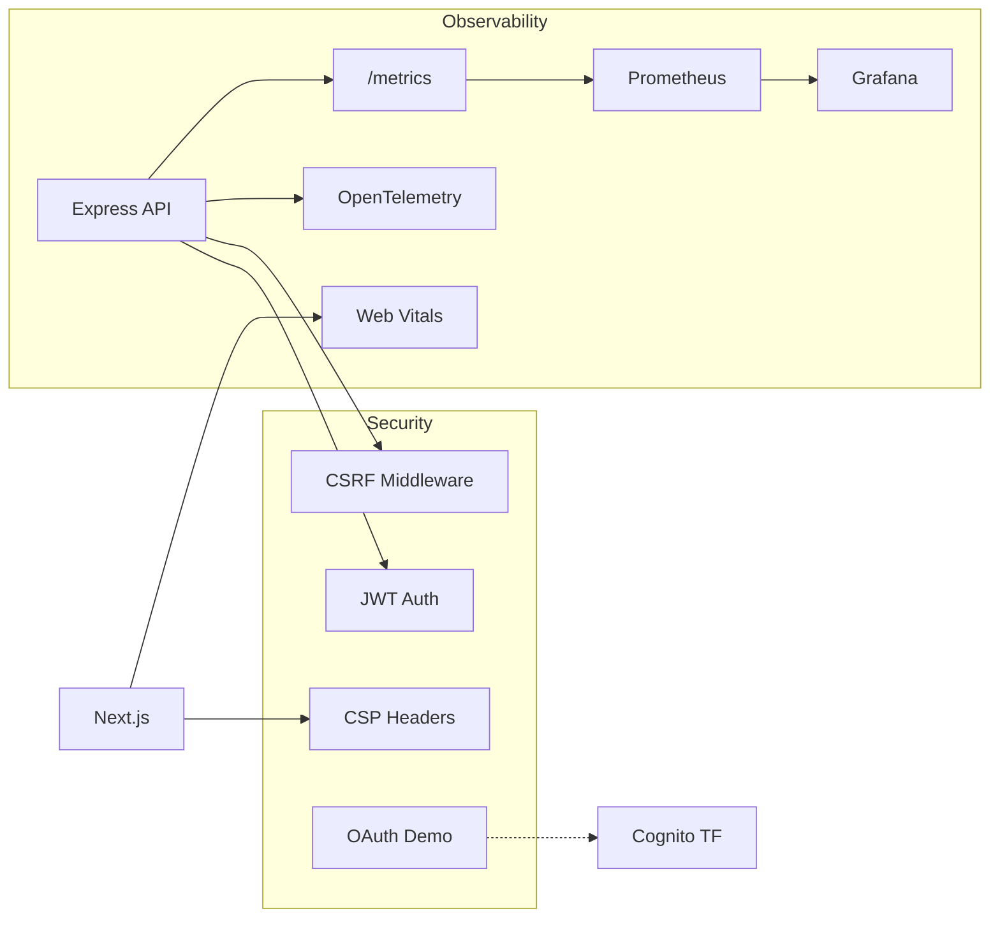
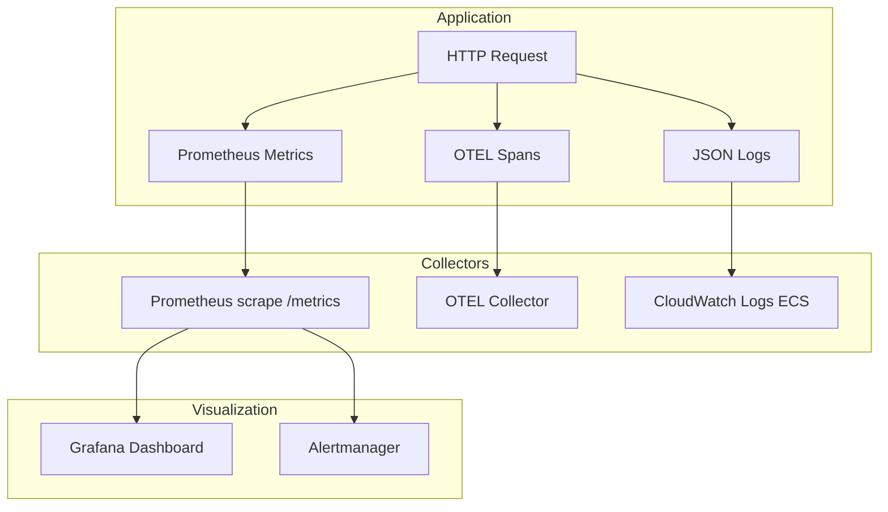
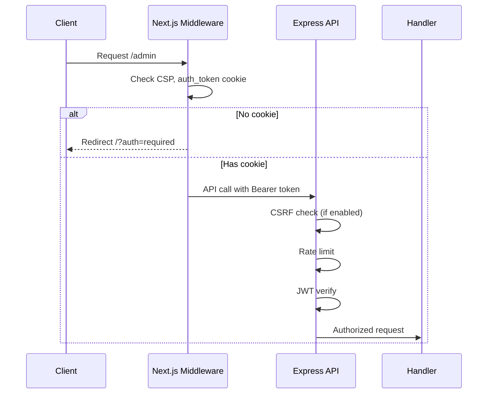

# Tier 4 — Observability & Security

Production operations: OpenTelemetry tracing, Grafana dashboards, Prometheus alerts, Web Vitals, OAuth demo scaffold, CSRF protection, Content Security Policy, and Terraform secrets patterns.

**Prerequisites:** [Tiers 1–3](./README.md)

---

## Table of Contents

- [Overview](#overview)
- [Feature Table](#feature-table)
- [Architecture](#architecture)
- [Feature Deep Dives](#feature-deep-dives)
  - [OpenTelemetry](#1-opentelemetry-otel_exporter_otlp_endpoint)
  - [Grafana Dashboard](#2-grafana-dashboard-json)
  - [Prometheus Alerts](#3-prometheus-alerts)
  - [Web Vitals](#4-web-vitals)
  - [OAuth Demo](#5-oauth-demo-oauthdemo)
  - [CSRF Middleware](#6-csrf-middleware-enable_csrftrue)
  - [CSP in Next Middleware](#7-csp-in-next-middleware)
  - [Secrets in Terraform](#8-secrets-in-terraform-document-pattern)
- [React vs Next.js Comparison](#react-vs-nextjs-comparison)
- [Runnable Demo Commands](#runnable-demo-commands)
- [Interview Q&A](#interview-qa)

---

## Overview

Tier 4 answers: **"How do you know the system is healthy?"** and **"How do you protect it?"** The repo includes metrics, tracing hooks, alerting rules, security middleware, and infrastructure patterns for secrets management.



---

## Feature Table

| Feature | Path(s) | Enable |
|---------|---------|--------|
| OpenTelemetry bootstrap | `apps/api/src/telemetry.ts` | `OTEL_EXPORTER_OTLP_ENDPOINT` |
| Metrics middleware | `apps/api/src/middleware/metrics.ts` | Always on |
| Prometheus endpoint | `apps/api/src/app.ts` | `GET /metrics` |
| Structured logging | `apps/api/src/middleware/logging.ts` | Always on |
| Grafana dashboard | `infrastructure/grafana/dashboard.json` | Import to Grafana |
| Prometheus alerts | `infrastructure/prometheus/alerts.yml` | PrometheusRule CR or file |
| Web Vitals reporter | `apps/web/src/components/WebVitalsReporter.tsx` | Dev console |
| OAuth demo endpoint | `apps/api/src/app.ts` | `GET /oauth/demo` |
| Cognito Terraform | `infrastructure/aws/cognito.tf` | `enable_cognito=true` |
| CSRF middleware | `apps/api/src/middleware/csrf.ts` | `ENABLE_CSRF=true` |
| CSP headers | `apps/web/src/middleware.ts` | Always on |
| Security headers | `apps/web/src/middleware.ts` | X-Frame-Options, etc. |
| Rate limiting | `apps/api/src/middleware/rate-limit.ts` | `RATE_LIMIT_MAX` |
| JWT auth | `apps/api/src/middleware/auth.ts` | `ENABLE_AUTH=true` |
| Health/readiness | `apps/api/src/app.ts` | `/health`, `/ready` |
| Scenario degradation | `apps/api/src/events/scenario-simulator.ts` | `/scenarios` |

---

## Architecture

### Observability Stack



### Security Request Flow



---

## Feature Deep Dives

### 1. OpenTelemetry (OTEL_EXPORTER_OTLP_ENDPOINT)

`apps/api/src/telemetry.ts`:

```typescript
export async function initTelemetry(serviceName = "interview-api"): Promise<void> {
  if (!process.env.OTEL_EXPORTER_OTLP_ENDPOINT) return;

  const { NodeSDK } = await import("@opentelemetry/sdk-node");
  const { getNodeAutoInstrumentations } = await import("@opentelemetry/auto-instrumentations-node");
  const { OTLPTraceExporter } = await import("@opentelemetry/exporter-trace-otlp-http");

  const sdk = new NodeSDK({
    serviceName,
    traceExporter: new OTLPTraceExporter(),
    instrumentations: [getNodeAutoInstrumentations()],
  });
  sdk.start();
}
```

Called at app startup in `apps/api/src/app.ts` via `await initTelemetry()`.

**Enable locally with Jaeger/OTEL collector:**

```bash
OTEL_EXPORTER_OTLP_ENDPOINT=http://localhost:4318/v1/traces npm run dev -w @interview/api
```

Auto-instrumentation captures Express routes, HTTP client calls, and more without manual span creation.

### 2. Grafana Dashboard JSON

`infrastructure/grafana/dashboard.json` defines panels:

| Panel | PromQL |
|-------|--------|
| Request Rate | `rate(http_requests_total[5m])` |
| Error Rate | `rate(http_requests_total{status=~"5.."}[5m])` |
| P95 Latency | `histogram_quantile(0.95, rate(http_request_duration_seconds_bucket[5m]))` |

Metrics emitted by `apps/api/src/middleware/metrics.ts` on every request.

**Import:** Grafana → Dashboards → Import → upload JSON or paste content.

### 3. Prometheus Alerts

`infrastructure/prometheus/alerts.yml`:

```yaml
- alert: HighErrorRate
  expr: rate(http_requests_total{status=~"5.."}[5m]) > 0.05
  for: 2m
  labels:
    severity: critical

- alert: ApiDown
  expr: up{job="interview-api"} == 0
  for: 1m
```

Deploy as PrometheusRule in Kubernetes or mount in Prometheus config. Pair with Alertmanager for PagerDuty/Slack routing.

### 4. Web Vitals

`apps/web/src/components/WebVitalsReporter.tsx` uses Next.js built-in `useReportWebVitals`:

| Metric | Meaning | Good Target |
|--------|---------|-------------|
| LCP | Largest Contentful Paint | < 2.5s |
| INP | Interaction to Next Paint | < 200ms |
| CLS | Cumulative Layout Shift | < 0.1 |

In development, metrics log to console as JSON. Production: forward to analytics pipeline alongside server-side metrics for full RUM picture.

React SPA would use the `web-vitals` npm package manually — Next.js integrates natively.

### 5. OAuth Demo (/oauth/demo)

`apps/api/src/app.ts`:

```typescript
app.get("/oauth/demo", (_req, res) => {
  res.json({
    message: "OAuth2/OIDC demo scaffold — production: Cognito, Auth0, or ALB authenticate",
    authorizeUrl: "/api/auth/login",
    tokenUrl: "/api/auth/login",
    refreshUrl: "/api/auth/refresh",
    docs: "docs/tiers/tier-4-observability-security.md",
  });
});
```

This documents the **OAuth2 authorization code flow** endpoints. Production implementation via `infrastructure/aws/cognito.tf`:

```hcl
resource "aws_cognito_user_pool" "main" {
  count = var.enable_cognito ? 1 : 0
  ...
}
resource "aws_cognito_user_pool_client" "web" {
  explicit_auth_flows = ["ALLOW_USER_PASSWORD_AUTH", "ALLOW_REFRESH_TOKEN_AUTH"]
}
```

**Flow:** User → Cognito Hosted UI → authorization code → token exchange → JWT → API validates via Cognito JWKS.

### 6. CSRF Middleware (ENABLE_CSRF=true)

`apps/api/src/middleware/csrf.ts` implements double-submit cookie pattern:

```typescript
const header = req.headers["x-csrf-token"];
const cookie = req.headers.cookie?.match(/csrf_token=([^;]+)/)?.[1];

if (process.env.ENABLE_CSRF === "true" && header !== cookie) {
  return res.status(403).json({ error: "CSRF token mismatch" });
}
```

- Skips GET/HEAD/OPTIONS (safe methods)
- Skips `/api/auth/login` (initial auth)
- Requires matching `X-CSRF-Token` header and `csrf_token` cookie on mutations

**When needed:** Cookie-based sessions where the browser auto-sends cookies. Less critical for Bearer token APIs (tokens aren't sent automatically).

### 7. CSP in Next Middleware

`apps/web/src/middleware.ts`:

```typescript
response.headers.set(
  "Content-Security-Policy",
  "default-src 'self'; script-src 'self' 'unsafe-inline' 'unsafe-eval'; style-src 'self' 'unsafe-inline'; connect-src 'self' http://localhost:4000 ws://localhost:4000"
);
```

Also sets:

- `X-Frame-Options: DENY` — clickjacking protection
- `X-Content-Type-Options: nosniff` — MIME sniffing protection
- `Referrer-Policy: strict-origin-when-cross-origin`

**Production CSP:** Remove `'unsafe-inline'` and `'unsafe-eval'` using nonces or hashes. Tighten `connect-src` to production API domain.

### 8. Secrets in Terraform (Document Pattern)

The repo uses environment variables in ECS task definitions (`infrastructure/aws/ecs.tf`). **Production pattern** — AWS Secrets Manager:

```hcl
# Recommended pattern (add to infrastructure/aws/)
resource "aws_secretsmanager_secret" "jwt_secret" {
  name = "${var.app_name}/jwt-secret"
}

resource "aws_secretsmanager_secret_version" "jwt_secret" {
  secret_id     = aws_secretsmanager_secret.jwt_secret.id
  secret_string = var.jwt_secret  # from TF_VAR or external data source
}

# In ECS task definition container_definitions:
secrets = [{
  name      = "JWT_SECRET"
  valueFrom = aws_secretsmanager_secret.jwt_secret.arn
}]
```

**Principles:**

| Do | Don't |
|----|-------|
| Store secrets in Secrets Manager/SSM | Commit secrets to git |
| Use ECS `secrets` block | Put secrets in plain `environment` |
| Rotate via AWS automation | Share one JWT secret forever |
| IAM least privilege for task role | Give ECS task admin access |

Execution role needs `secretsmanager:GetSecretValue` on the secret ARN. Task role accesses DynamoDB — separate concerns (`infrastructure/aws/iam.tf`).

---

## React vs Next.js Comparison

| Security/Observability | React SPA | Next.js |
|------------------------|-----------|---------|
| **CSP** | Set in nginx (`apps/react-spa/nginx.conf`) | Edge middleware on every request |
| **CSRF** | Bearer tokens — CSRF less relevant | Cookie auth — CSRF matters for Server Actions |
| **Web Vitals** | Manual `web-vitals` package | Built-in `useReportWebVitals` |
| **Error tracking** | Client-side Sentry SDK | Sentry Next.js SDK (server + client) |
| **Auth token exposure** | localStorage (XSS risk) | localStorage + cookie (mitigate with httpOnly) |
| **Security headers** | nginx/reverse proxy | Middleware + hosting platform |

Both apps benefit from the same API-side security: rate limiting, JWT validation, CSRF (when cookie sessions), and structured logging.

---

## Runnable Demo Commands

```bash
# Prometheus metrics
curl http://localhost:4000/metrics | head -20

# Generate traffic for metrics
for i in $(seq 1 10); do curl -s http://localhost:4000/health > /dev/null; done

# OpenTelemetry (requires collector on :4318)
OTEL_EXPORTER_OTLP_ENDPOINT=http://localhost:4318/v1/traces \
  npm run dev -w @interview/api

# OAuth demo scaffold
curl http://localhost:4000/oauth/demo | jq

# Enable CSRF protection
ENABLE_CSRF=true npm run dev -w @interview/api
# POST without token → 403

# CSP headers check
curl -I http://localhost:3000/ | grep -i content-security

# Admin redirect (middleware auth)
curl -I http://localhost:3000/admin

# Degraded health scenario
curl -X POST http://localhost:4000/api/scenarios/api_degraded/trigger
curl http://localhost:4000/health  # status: degraded, HTTP 503

# Readiness probe
curl http://localhost:4000/ready

# Web Vitals — open Next.js in browser, check console

# Rate limit test
for i in $(seq 1 150); do curl -s -o /dev/null -w "%{http_code}\n" http://localhost:4000/health; done
# Eventually 429 if RATE_LIMIT_MAX exceeded
```

---

## Interview Q&A

### Q1: What's the difference between metrics, logs, and traces?

**A:** **Metrics** are aggregated numbers (request rate, error rate, latency histograms) — good for dashboards and alerts. **Logs** are discrete events with context — good for debugging specific requests. **Traces** follow a request across services — good for understanding latency in distributed systems. Use all three (three pillars of observability).

### Q2: When would you enable CSRF protection?

**A:** When using cookie-based authentication where browsers automatically attach cookies. Not needed for Bearer token in Authorization header (unless also using cookies). This API supports both patterns — enable CSRF when moving to session cookies.

### Q3: Explain CSP and why 'unsafe-inline' is in the demo.

**A:** CSP whitelists script/style sources to mitigate XSS. `'unsafe-inline'` allows inline scripts — required for some dev tools and Next.js hydration in development. Production uses nonces: server generates per-request nonce, scripts include `nonce` attribute.

### Q4: How do Prometheus alerts differ from Grafana dashboards?

**A:** Dashboards visualize current state for humans. Alerts define automated thresholds that fire notifications (PagerDuty, Slack) when conditions persist. Alert on symptoms (error rate, latency) not causes (CPU) when possible.

### Q5: Why OpenTelemetry over vendor-specific SDKs?

**A:** OTEL is vendor-neutral — instrument once, export to Jaeger, Datadog, Honeycomb, or AWS X-Ray via exporter config. Avoids lock-in and provides consistent propagation across microservices.

### Q6: How would you migrate from demo JWT to Cognito?

**A:** (1) Enable Cognito Terraform, (2) replace `/api/auth/login` with Cognito token endpoint in frontends, (3) API validates JWT against Cognito JWKS URL instead of local secret, (4) map Cognito groups to RBAC roles, (5) remove demo user store.

### Q7: What should ECS task role vs execution role access?

**A:** **Execution role:** pull images, write logs, read secrets for container startup. **Task role:** runtime permissions (DynamoDB, S3). Never give both admin — least privilege per role (`infrastructure/aws/iam.tf`).

---

**Previous:** [Tier 3 — Backend & Data](./tier-3-backend-data.md) | **Next:** [Tier 5 — Infra & CI/CD](./tier-5-infra-cicd.md) | [Index](./README.md)
