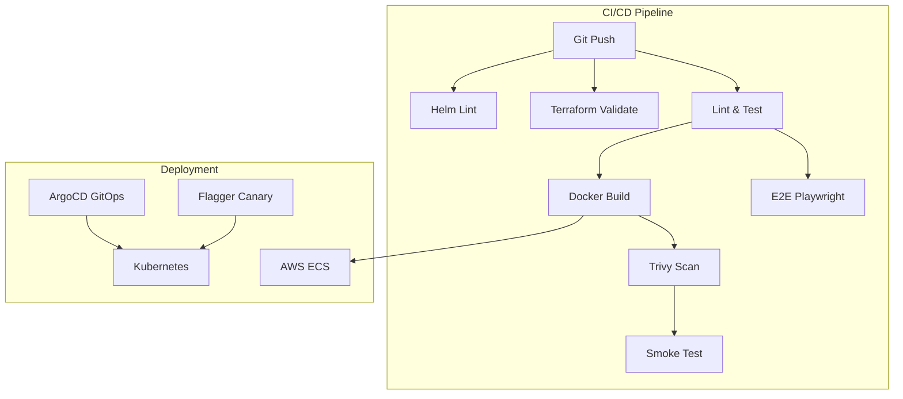
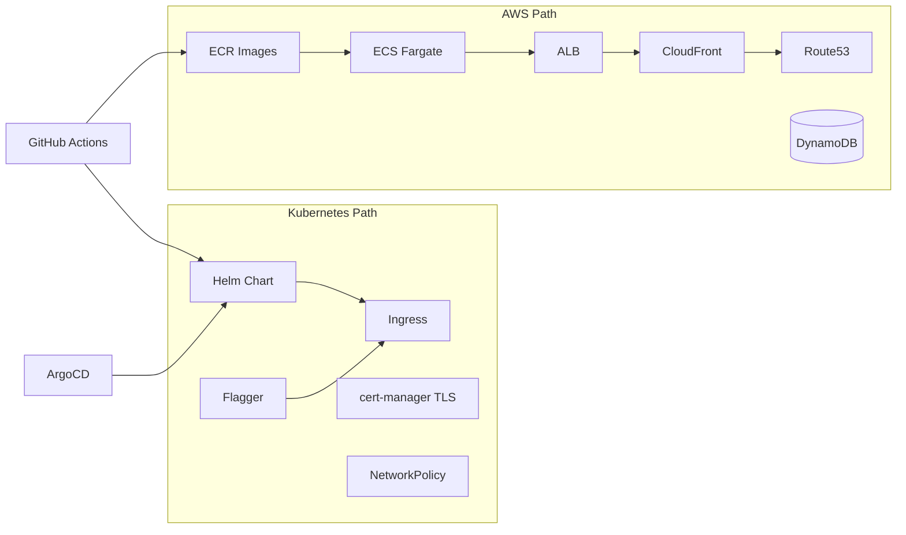
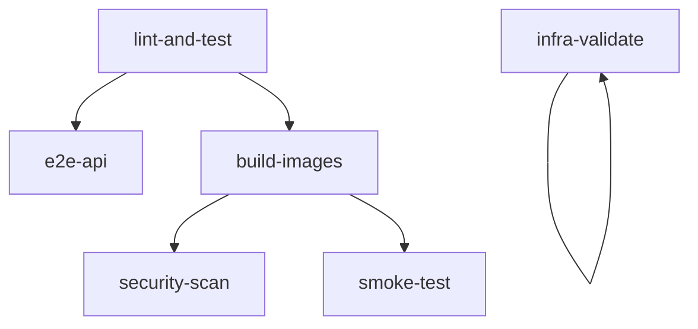

# Tier 5 — Infra & CI/CD

Deployment and automation: GitOps with ArgoCD, Flagger canary releases, cert-manager TLS, CloudFront CDN, Route53 DNS, Cognito auth, NetworkPolicy, Dependabot, k6 load tests, and comprehensive CI pipelines.

**Prerequisites:** [Tiers 1–4](./README.md)

---

## Table of Contents

- [Overview](#overview)
- [Feature Table](#feature-table)
- [Architecture](#architecture)
- [Feature Deep Dives](#feature-deep-dives)
  - [GitOps ArgoCD](#1-gitops-argocd-application)
  - [Flagger Canary](#2-flagger-canary)
  - [cert-manager ClusterIssuer](#3-cert-manager-clusterissuer)
  - [CloudFront CDN](#4-cloudfront-cdn-terraform)
  - [Route53](#5-route53-terraform)
  - [Cognito](#6-cognito-terraform)
  - [NetworkPolicy](#7-networkpolicy)
  - [Dependabot](#8-dependabot)
  - [k6 Load Tests](#9-k6-load-tests)
  - [CI Pipeline](#10-ci-trivy-helm-lint-terraform-validate-e2e-smoke-tests)
  - [Docker Compose Full Profile](#11-react-spa-in-docker-compose-full-profile)
- [React vs Next.js Comparison](#react-vs-nextjs-comparison)
- [Runnable Demo Commands](#runnable-demo-commands)
- [Interview Q&A](#interview-qa)

---

## Overview

Tier 5 covers **how code reaches production safely**: infrastructure as code, progressive delivery, network isolation, automated dependency updates, load testing, and multi-stage CI validation.



---

## Feature Table

| Feature | Path(s) | Command / Trigger |
|---------|---------|-------------------|
| CI workflow | `.github/workflows/ci.yml` | Push to main/develop |
| CD AWS workflow | `.github/workflows/cd-aws.yml` | Manual / tag |
| CD Kubernetes workflow | `.github/workflows/cd-kubernetes.yml` | Manual / tag |
| ArgoCD Application | `infrastructure/gitops/argocd-application.yaml` | `kubectl apply` |
| Flagger Canary | `infrastructure/kubernetes/canary/flagger-canary.yaml` | Flagger operator |
| cert-manager Issuer | `infrastructure/kubernetes/cert-manager/cluster-issuer.yaml` | ClusterIssuer |
| CloudFront CDN | `infrastructure/aws/cloudfront.tf` | `terraform apply` |
| Route53 DNS | `infrastructure/aws/route53.tf` | `create_route53_zone=true` |
| Cognito | `infrastructure/aws/cognito.tf` | `enable_cognito=true` |
| NetworkPolicy | `infrastructure/kubernetes/manifests/network-policy.yaml` | API pod isolation |
| Dependabot | `.github/dependabot.yml` | Weekly PRs |
| k6 load test | `load-tests/k6.js` | `k6 run load-tests/k6.js` |
| Helm chart | `infrastructure/kubernetes/helm/interview-stack/` | `helm lint` |
| K8s manifests | `infrastructure/kubernetes/manifests/` | Raw YAML deploy |
| Istio VirtualService | `infrastructure/kubernetes/istio/virtual-service.yaml` | Tier 6 canary |
| ECS Terraform | `infrastructure/aws/ecs.tf` | Fargate services |
| VPC Terraform | `infrastructure/aws/vpc.tf` | Network foundation |
| DynamoDB Terraform | `infrastructure/aws/dynamodb.tf` | Tables + GSI |
| docker-compose full | `docker-compose.yml` | `--profile full` |
| React SPA service | `docker-compose.yml` | Port 8080 |
| E2E tests | `e2e/api.spec.ts`, `e2e/web.spec.ts` | Playwright |
| Playwright config | `playwright.config.ts` | Auto e2e-server |

---

## Architecture

### Dual Cloud Deployment



### CI Job Dependency Graph



---

## Feature Deep Dives

### 1. GitOps ArgoCD Application

`infrastructure/gitops/argocd-application.yaml`:

```yaml
apiVersion: argoproj.io/v1alpha1
kind: Application
metadata:
  name: interview-stack
  namespace: argocd
spec:
  source:
    repoURL: https://github.com/thensanity/interview-stack-guide.git
    targetRevision: master
    path: infrastructure/kubernetes/helm/interview-stack
    helm:
      valueFiles:
        - values.yaml
  destination:
    server: https://kubernetes.default.svc
    namespace: staging
  syncPolicy:
    automated:
      prune: true
      selfHeal: true
```

**GitOps principles:**

- Git is the source of truth — not `kubectl apply` from laptops
- ArgoCD reconciles cluster state to declared manifests
- `selfHeal: true` reverts manual cluster drift
- `prune: true` removes resources deleted from git

### 2. Flagger Canary

`infrastructure/kubernetes/canary/flagger-canary.yaml`:

```yaml
spec:
  analysis:
    interval: 1m
    threshold: 5
    maxWeight: 50
    stepWeight: 10
  metrics:
    - name: request-success-rate
      thresholdRange:
        min: 99
```

Progressive delivery: 10% → 20% → ... → 50% traffic to canary while monitoring success rate. Automatic rollback if metrics fail.

**Contrast with Istio:** Flagger automates weight shifts; Istio VirtualService (Tier 6) defines manual 90/10 split.

### 3. cert-manager ClusterIssuer

`infrastructure/kubernetes/cert-manager/cluster-issuer.yaml`:

```yaml
apiVersion: cert-manager.io/v1
kind: ClusterIssuer
metadata:
  name: letsencrypt-staging
spec:
  acme:
    server: https://acme-staging-v02.api.letsencrypt.org/directory
    solvers:
      - http01:
          ingress:
            class: nginx
```

Referenced by Ingress TLS in `infrastructure/kubernetes/manifests/ingress.yaml`:

```yaml
tls:
  - hosts: [interview.local]
    secretName: interview-tls
```

cert-manager obtains and auto-renews Let's Encrypt certificates.

### 4. CloudFront CDN (Terraform)

`infrastructure/aws/cloudfront.tf`:

- Origin: ALB (`aws_lb.main.dns_name`)
- HTTPS-only to origin
- Caches GET/HEAD responses
- Forwards query strings for dynamic pages

**Use case:** Cache static assets globally; reduce ALB load and latency for distant users. SSR pages may use shorter TTL or cache-bypass headers.

### 5. Route53 (Terraform)

`infrastructure/aws/route53.tf`:

```hcl
resource "aws_route53_record" "app" {
  name = var.domain_name
  type = "A"
  alias {
    name    = aws_lb.main.dns_name
    zone_id = aws_lb.main.zone_id
  }
}
```

Enable with `create_route53_zone = true`. Alias record points domain to ALB without CNAME at apex limitations.

### 6. Cognito (Terraform)

`infrastructure/aws/cognito.tf` — optional managed auth:

```hcl
variable "enable_cognito" {
  type    = bool
  default = false
}
```

When enabled, creates User Pool + App Client with password auth and refresh token flows. Integrates with ALB authenticate action or frontend OIDC libraries.

### 7. NetworkPolicy

`infrastructure/kubernetes/manifests/network-policy.yaml`:

```yaml
spec:
  podSelector:
    matchLabels:
      app: interview-api
  ingress:
    - from:
        - podSelector:
            matchLabels:
              app: interview-web
      ports:
        - protocol: TCP
          port: 4000
```

**Effect:** Only web pods can reach API pods on port 4000. External traffic must go through Ingress → web → API. Defense in depth even if a pod is compromised.

### 8. Dependabot

`.github/dependabot.yml`:

```yaml
updates:
  - package-ecosystem: npm
    directory: "/"
    schedule:
      interval: weekly
  - package-ecosystem: docker
    directory: "/apps/api"
    schedule:
      interval: weekly
```

Automated PRs for npm and Docker base image updates. Review and merge to keep CVE exposure low — complements Trivy scanning in CI.

### 9. k6 Load Tests

`load-tests/k6.js`:

```javascript
export const options = {
  vus: 10,
  duration: "30s",
  thresholds: {
    http_req_duration: ["p(95)<500"],
    http_req_failed: ["rate<0.01"],
  },
};
```

Tests `/health` and `/api/products` under 10 virtual users for 30 seconds.

```bash
# Install k6: https://k6.io/docs/get-started/installation/
k6 run load-tests/k6.js
API_URL=http://staging.example.com k6 run load-tests/k6.js
```

**Interview tip:** k6 scripts are code — version control thresholds alongside application code. Fail CI if p95 exceeds SLO.

### 10. CI: Trivy, Helm Lint, Terraform Validate, E2E, Smoke Tests

`.github/workflows/ci.yml` jobs:

| Job | Steps | Purpose |
|-----|-------|---------|
| `lint-and-test` | `npm ci`, build packages, lint, vitest | Code quality |
| `e2e-api` | Playwright against e2e-server | Integration |
| `infra-validate` | `terraform validate`, `helm lint` | IaC correctness |
| `build-images` | Matrix: api, web, react-spa Dockerfiles | Reproducible builds |
| `security-scan` | Trivy on API image (CRITICAL/HIGH) | Container CVEs |
| `smoke-test` | Run API container, curl `/health` | Post-build sanity |

**E2E details:** `playwright.config.ts` starts `apps/api/src/e2e-server.ts` automatically. Tests cover auth, validation, OpenAPI, metrics, scenarios.

**Web E2E:** `e2e/web.spec.ts` requires `E2E_WEB_URL=http://localhost:3000` — optional in CI, run locally.

### 11. React SPA in docker-compose Full Profile

`docker-compose.yml` profile `full` includes:

| Service | Port | Profile |
|---------|------|---------|
| mongodb | 27017 | default + full |
| redis | 6379 | default + full |
| api | 4000 | full |
| web | 3000 | full |
| react-spa | 8080 | full |

```bash
docker compose --profile full up -d --build
```

React SPA nginx serves static build; depends on healthy API. Web container receives `NEXT_PUBLIC_API_URL=http://localhost:4000` (browser on host reaches API via localhost).

**No Node required** — full demo for interview presentations.

---

## React vs Next.js Comparison

| Deployment Aspect | React SPA | Next.js |
|-------------------|-----------|---------|
| **Container** | nginx serving static `dist/` | Node.js server (standalone output) |
| **Dockerfile** | `apps/react-spa/Dockerfile` | `apps/web/Dockerfile` |
| **CDN caching** | All assets highly cacheable | Static assets cacheable; HTML may vary |
| **ECS service** | Could serve from S3+CloudFront only | Requires compute for SSR |
| **Health check** | `wget localhost/` | `wget localhost:3000/` |
| **Env injection** | Build-time `VITE_*` vars | Build-time `NEXT_PUBLIC_*` vars |
| **Helm deployment** | Optional static hosting | `web-deployment.yaml` |

Both images built in CI matrix job `build-images`. Same ECR push pattern for ECS.

---

## Runnable Demo Commands

```bash
# Full local CI simulation
npm ci
npm run build -w @interview/types
npm run build -w @interview/db
npm run build -w @interview/graphql
npm run test --workspaces --if-present
npm run test:e2e

# Terraform validate
terraform -chdir=infrastructure/aws init -backend=false
terraform -chdir=infrastructure/aws validate

# Helm lint
helm lint infrastructure/kubernetes/helm/interview-stack

# Docker full stack
docker compose --profile full up -d --build

# Verify services
curl http://localhost:4000/health
curl http://localhost:3000/
curl http://localhost:8080/

# k6 load test (requires k6 installed)
k6 run load-tests/k6.js

# Trivy scan locally
docker build -f apps/api/Dockerfile -t interview-api:local .
trivy image interview-api:local

# Helm dry-run
helm upgrade --install interview-stack \
  infrastructure/kubernetes/helm/interview-stack \
  --namespace staging --create-namespace \
  --dry-run

# Apply ArgoCD app (requires ArgoCD installed)
kubectl apply -f infrastructure/gitops/argocd-application.yaml

# Apply NetworkPolicy
kubectl apply -f infrastructure/kubernetes/manifests/network-policy.yaml

# Build all CI images
docker build -f apps/api/Dockerfile -t interview-api .
docker build -f apps/web/Dockerfile \
  --build-arg NEXT_PUBLIC_API_URL=http://localhost:4000 \
  --build-arg NEXT_PUBLIC_GRAPHQL_URL=http://localhost:4000/graphql \
  -t interview-web .
docker build -f apps/react-spa/Dockerfile -t interview-react-spa .
```

---

## Interview Q&A

### Q1: GitOps vs traditional CI/CD push deploy?

**A:** Traditional CI/CD pipelines push changes to cluster (`kubectl apply`, `helm upgrade`). GitOps uses a controller (ArgoCD) that pulls from git and reconciles. Benefits: audit trail, easy rollback (git revert), drift detection, consistent cluster state.

### Q2: Explain canary vs blue-green deployment.

**A:** **Blue-green:** two full environments, instant switch, double resources during cutover. **Canary:** gradual traffic shift (1% → 10% → 100%) with automated metric checks. Flagger implements canary with automatic rollback. Blue-green is simpler; canary is safer for risky changes.

### Q3: Why NetworkPolicy if we already have a firewall?

**A:** NetworkPolicy is **pod-level** segmentation inside the cluster. A compromised web pod can't scan internal services or reach API directly from an attacker-controlled process. Firewalls protect cluster perimeter; NetworkPolicy protects east-west traffic.

### Q4: What does Trivy scan and why in CI?

**A:** Trivy scans container images for OS package and application dependency CVEs. Running in CI blocks (or warns on) CRITICAL/HIGH findings before images reach production. Complements Dependabot which updates dependencies proactively.

### Q5: How do k6 thresholds enforce SLOs?

**A:** Thresholds like `p(95)<500` fail the test run if 95th percentile latency exceeds 500ms. Integrate into CI to prevent performance regressions merging to main — same as unit tests for speed.

### Q6: Why separate Terraform validate from apply in CI?

**A:** Validate catches syntax and reference errors cheaply without AWS credentials or state locks. Every PR gets IaC feedback. Apply runs in controlled CD pipeline with approval gates.

### Q7: CloudFront in front of SSR Next.js — caching considerations?

**A:** Cache static assets (`/_next/static/*`) aggressively. Dynamic HTML pages need short TTL or cache key including cookies/headers. Use `Cache-Control` headers from Next.js. API routes should bypass CDN or route to ALB directly.

---

**Previous:** [Tier 4 — Observability & Security](./tier-4-observability-security.md) | **Next:** [Tier 6 — Advanced Architecture](./tier-6-advanced-architecture.md) | [Index](./README.md)
