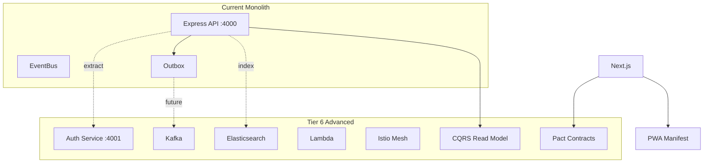
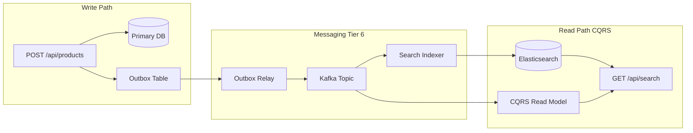
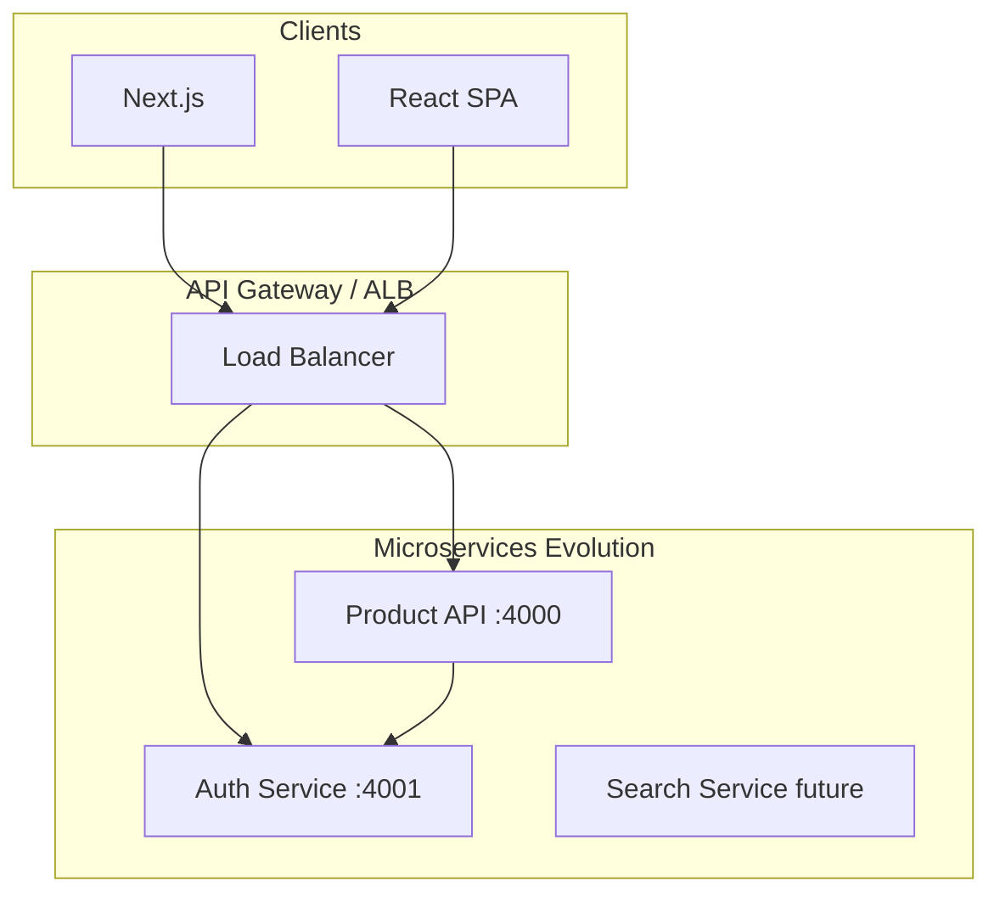
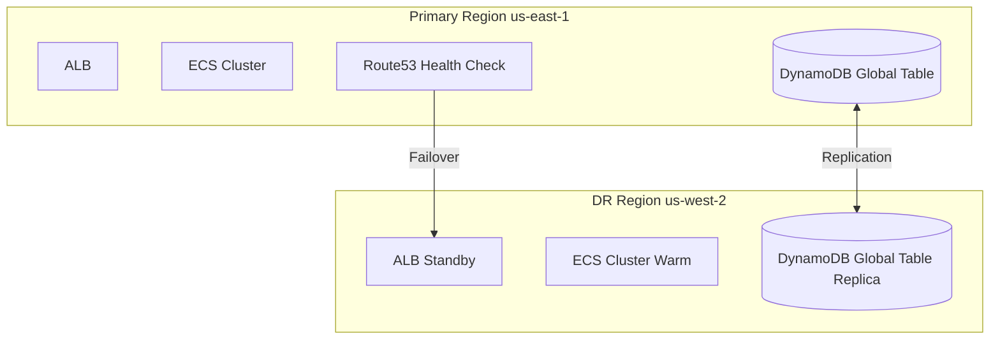

# Tier 6 — Advanced Architecture

Distributed systems patterns: auth microservice, Kafka messaging, Elasticsearch search, Lambda serverless scaffold, Istio canary routing, CQRS read models, Pact contract testing, PWA manifest, and multi-region disaster recovery.

**Prerequisites:** [All prior tiers](./README.md)

---

## Table of Contents

- [Overview](#overview)
- [Feature Table](#feature-table)
- [Architecture](#architecture)
- [Feature Deep Dives](#feature-deep-dives)
  - [Auth Microservice](#1-auth-microservice-servicesauth-service-on-4001)
  - [Kafka Docker Profile](#2-kafka-docker-profile-messaging)
  - [Elasticsearch Docker Profile](#3-elasticsearch-docker-profile-search)
  - [Lambda Terraform Scaffold](#4-lambda-terraform-scaffold)
  - [Istio VirtualService Canary](#5-istio-virtualservice-canary)
  - [CQRS Read Model](#6-cqrs-read-model-packagesevents)
  - [Pact Contracts Scaffold](#7-pact-contracts-scaffold)
  - [PWA Manifest](#8-pwa-manifest)
  - [Multi-Region DR](#9-multi-region-dr-talking-points)
- [React vs Next.js Comparison](#react-vs-nextjs-comparison)
- [Runnable Demo Commands](#runnable-demo-commands)
- [Interview Q&A](#interview-qa)

---

## Overview

Tier 6 represents **where the monolith could evolve**: extracted services, event-driven architecture, specialized search infrastructure, serverless components, service mesh traffic management, and enterprise reliability patterns.



---

## Feature Table

| Feature | Path(s) | Port / Enable |
|---------|---------|---------------|
| Auth microservice | `services/auth-service/src/index.ts` | `:4001` |
| Event bus | `packages/events/src/event-bus.ts` | In-process |
| CQRS read model | `packages/events/src/cqrs-read-model.ts` | In-memory projection |
| Event types | `packages/events/src/types.ts` | Domain events |
| Kafka service | `docker-compose.yml` | profile `messaging`, `:9092` |
| Elasticsearch | `docker-compose.yml` | profile `search`, `:9200` |
| Lambda Terraform | `infrastructure/aws/lambda.tf` | `enable_lambda=true` |
| Lambda health zip | `infrastructure/aws/lambda/health.zip` | Scaffold |
| Istio VirtualService | `infrastructure/kubernetes/istio/virtual-service.yaml` | 90/10 canary |
| Pact README | `contracts/pact/README.md` | Consumer-driven |
| PWA manifest | `apps/web/public/manifest.json` | `/manifest.json` |
| Offline banner | `apps/web/src/components/OfflineBanner.tsx` | Network status |
| WebSocket events | `apps/api/src/websocket/event-ws.ts` | `/api/events/ws` |
| Scenario simulator | `apps/api/src/events/scenario-simulator.ts` | Failure injection |
| Search (in-memory) | `apps/api/src/routes/search.ts` | Bridge to ES |

---

## Architecture

### Event-Driven Evolution



### Service Decomposition



---

## Feature Deep Dives

### 1. Auth Microservice (services/auth-service on :4001)

`services/auth-service/src/index.ts`:

```typescript
const app = express();
app.get("/health", (_req, res) => res.json({ status: "ok", service: "auth-service" }));

app.post("/login", (req, res) => {
  const match = users.find(u => u.email === req.body.email && u.password === req.body.password);
  if (!match) return res.status(401).json({ error: "Invalid credentials" });
  res.json({ data: { token: "microservice-jwt-demo", user: { email: match.email, role: match.role } } });
});

app.listen(process.env.PORT ?? 4001);
```

**Run:**

```bash
npx tsx services/auth-service/src/index.ts
curl -X POST http://localhost:4001/login \
  -H "Content-Type: application/json" \
  -d '{"email":"admin@interview.local","password":"interview123"}'
```

**Why extract auth?**

- Independent scaling (auth spikes during login events)
- Separate deployment cadence and security audit scope
- Shared across multiple APIs (products, orders, billing)
- Centralized token issuance (OAuth2/OIDC)

**Migration path:** API gateway validates JWT from auth service; product API trusts JWKS from auth service instead of local `createAuthService`.

### 2. Kafka Docker Profile (messaging)

`docker-compose.yml`:

```yaml
kafka:
  image: bitnami/kafka:3.7
  profiles: ["messaging"]
  ports:
    - "9092:9092"
  environment:
    KAFKA_CFG_PROCESS_ROLES: controller,broker
    KAFKA_CFG_NODE_ID: 0
```

**Start:**

```bash
docker compose --profile messaging up -d kafka
```

**Integration points in this repo:**

- `apps/api/src/outbox/outbox.ts` — `relayOutbox()` simulates publishing; production publishes to Kafka topic
- `apps/api/src/jobs/queue.ts` — replace in-process queue with Kafka consumer groups

**Interview topics:** partitions for ordering, consumer groups for scale, exactly-once vs at-least-once semantics, dead letter queues.

### 3. Elasticsearch Docker Profile (search)

`docker-compose.yml`:

```yaml
elasticsearch:
  image: docker.elastic.co/elasticsearch/elasticsearch:8.15.0
  profiles: ["search"]
  ports:
    - "9200:9200"
  environment:
    discovery.type: single-node
    xpack.security.enabled: "false"
```

**Start:**

```bash
docker compose --profile search up -d elasticsearch
curl http://localhost:9200/_cluster/health
```

Current `apps/api/src/routes/search.ts` uses in-memory filter. Production path:

1. Product created → outbox → Kafka → indexer consumer
2. Consumer writes to Elasticsearch index
3. `/api/search` queries ES instead of `findAll()`

### 4. Lambda Terraform Scaffold

`infrastructure/aws/lambda.tf`:

```hcl
resource "aws_lambda_function" "health" {
  count         = var.enable_lambda ? 1 : 0
  function_name = "${var.app_name}-health"
  handler       = "index.handler"
  runtime       = "nodejs20.x"
  filename      = "${path.module}/lambda/health.zip"
}

variable "enable_lambda" {
  type    = bool
  default = false
}
```

**Use cases for Lambda alongside ECS:**

| Lambda | ECS |
|--------|-----|
| Spiky, infrequent workloads | Steady HTTP traffic |
| Webhook handlers | Long-running connections |
| Scheduled jobs (EventBridge) | WebSocket, GraphQL |
| Image processing triggers | Complex business logic |

Enable with `enable_lambda = true` in `terraform.tfvars`.

### 5. Istio VirtualService Canary

`infrastructure/kubernetes/istio/virtual-service.yaml`:

```yaml
spec:
  hosts:
    - interview.local
  http:
    - route:
        - destination:
            host: interview-web
          weight: 90
        - destination:
            host: interview-web-canary
          weight: 10
```

**Istio vs Flagger (Tier 5):**

| Istio VirtualService | Flagger Canary |
|---------------------|----------------|
| Manual weight configuration | Automated progressive rollout |
| Fine-grained traffic rules | Metric-driven rollback |
| Requires Istio control plane | Requires Flagger + Prometheus |

Use Istio for complex routing (header-based, fault injection); Flagger for automated canary analysis.

### 6. CQRS Read Model (packages/events)

`packages/events/src/cqrs-read-model.ts`:

```typescript
export interface ProductReadModel {
  id: string;
  name: string;
  price: number;
  category: string;
  searchText: string;
}

export function projectProductCreated(event: { productId, name, price, category }) {
  readModels.set(event.productId, {
    id: event.productId,
    name: event.name,
    price: event.price,
    category: event.category,
    searchText: `${event.name} ${event.category}`.toLowerCase(),
  });
}

export function queryReadModel(category?: string): ProductReadModel[] {
  return category ? all.filter(p => p.category === category) : all;
}
```

**CQRS pattern:**

- **Command side:** REST POST creates product in write DB, emits event
- **Query side:** Read model projection optimized for searches/listings
- **Benefit:** Scale reads independently; denormalize for access patterns

Event bus in `packages/events/src/event-bus.ts` connects write to read projections. Production: Kafka consumers build read models in Elasticsearch or Redis.

### 7. Pact Contracts Scaffold

`contracts/pact/README.md`:

```bash
# Consumer generates pact file
npm run pact:consumer -w @interview/web

# Provider verifies
npm run pact:provider -w @interview/api
```

**Consumer-driven contract testing:**

1. **Consumer** (Next.js, React SPA) declares expected API shape
2. Pact generates JSON contract file
3. **Provider** (Express API) verifies it satisfies all consumer contracts
4. CI publishes pacts to Pact Broker

**Why it matters for microservices:** Independent deploy units can't break each other silently. Provider verification runs in API CI before deploy.

Files to add in production:

| File | Purpose |
|------|---------|
| `contracts/products.consumer.pact.ts` | Web expects GET /api/products |
| `contracts/pact-broker.yml` | CI publishes pacts |

### 8. PWA Manifest

`apps/web/public/manifest.json`:

```json
{
  "name": "Interview Stack Guide",
  "short_name": "StackGuide",
  "start_url": "/",
  "display": "standalone",
  "background_color": "#0f172a",
  "theme_color": "#38bdf8",
  "icons": [{ "src": "/icon-192.png", "sizes": "192x192", "type": "image/png" }]
}
```

Link in `apps/web/src/app/layout.tsx` metadata (add `<link rel="manifest" href="/manifest.json" />`).

`apps/web/src/components/OfflineBanner.tsx` shows network status — PWA foundation for offline-first UX.

**Full PWA requires:** Service worker (caching strategies), manifest, HTTPS, icons. This repo provides manifest + offline detection as interview talking points.

### 9. Multi-Region DR Talking Points

The repo is single-region but designed for DR discussion:



**DR strategies by component:**

| Component | Strategy | RPO/RTO |
|-----------|----------|---------|
| DynamoDB | Global Tables | ~1s RPO |
| ECS | Multi-region active-passive | Minutes RTO with Route53 failover |
| MongoDB | Replica set cross-region | Configurable |
| S3/CloudFront | Cross-region replication | Near-zero RPO for static |
| Kafka | MirrorMaker 2 cross-cluster | Depends on lag tolerance |

**Interview framework:**

1. **Define RPO/RTO** — how much data loss and downtime is acceptable?
2. **Classify workloads** — auth is Tier 0; analytics is Tier 2
3. **Data replication** — DynamoDB Global Tables vs async S3 replication
4. **Traffic failover** — Route53 health checks + weighted routing
5. **Runbooks** — documented failover/failback procedures
6. **Game days** — quarterly DR drills

**Chaos connection:** Use `/scenarios` page to simulate failures before real DR events.

---

## React vs Next.js Comparison

| Advanced Pattern | React SPA | Next.js |
|------------------|-----------|---------|
| **Auth microservice** | Client calls `:4001/login` directly | BFF could proxy auth; hide service URL |
| **PWA** | Vite PWA plugin for service worker | Manifest + service worker via next-pwa |
| **Contract tests** | Consumer pact from react-spa | Consumer pact from web |
| **Real-time (Kafka)** | WebSocket/SSE client | Same — Client Component |
| **CQRS reads** | TanStack Query caches read model | Server Component fetches read API |
| **Offline** | Service worker caches API responses | SSR less offline-friendly; PWA caches shell |

Both frontends are **consumers** in event-driven architecture — they don't care whether search is in-memory or Elasticsearch if the API contract is stable (Pact ensures this).

---

## Runnable Demo Commands

```bash
# Auth microservice
npx tsx services/auth-service/src/index.ts &
curl http://localhost:4001/health
curl -X POST http://localhost:4001/login \
  -H "Content-Type: application/json" \
  -d '{"email":"admin@interview.local","password":"interview123"}'

# Kafka profile
docker compose --profile messaging up -d kafka
docker compose ps kafka

# Elasticsearch profile
docker compose --profile search up -d elasticsearch
curl http://localhost:9200/_cluster/health?pretty

# CQRS — trigger product create, inspect events
curl -X POST http://localhost:4000/api/products \
  -H "Content-Type: application/json" \
  -d '{"name":"CQRS Demo","description":"Event sourced","price":42,"category":"demo"}'
curl http://localhost:4000/api/events/stream  # SSE

# WebSocket events
# Connect via browser or wscat to ws://localhost:4000/api/events/ws

# Outbox → simulated Kafka relay
curl -X POST http://localhost:4000/api/outbox/relay

# PWA manifest
curl http://localhost:3000/manifest.json

# Istio canary (requires Istio installed)
kubectl apply -f infrastructure/kubernetes/istio/virtual-service.yaml

# Lambda scaffold validate
terraform -chdir=infrastructure/aws validate

# Full stack + messaging + search
docker compose --profile full --profile messaging --profile search up -d

# Pact workflow (scaffold)
cat contracts/pact/README.md
```

---

## Interview Q&A

### Q1: When should you extract a microservice from a monolith?

**A:** When a bounded context has different scaling needs, deployment frequency, team ownership, or failure isolation requirements. Auth is a classic first extraction — shared across products, security-sensitive, spiky traffic. Don't extract prematurely — monolith first is valid.

### Q2: Kafka vs direct HTTP between services?

**A:** HTTP for synchronous request-response (get user, validate token). Kafka for asynchronous events (product created → index, notify, analytics). Kafka decouples producers from consumers, buffers spikes, enables replay. Trade-off: eventual consistency complexity.

### Q3: Explain CQRS and when you'd use it.

**A:** Command Query Responsibility Segregation separates write models (normalized, transactional) from read models (denormalized, optimized). Use when read patterns differ heavily from writes, or read scale exceeds write scale. E-commerce product catalog is a classic example.

### Q4: What does Pact test that integration tests don't?

**A:** Integration tests verify one consumer against real provider. Pact verifies **all consumers' expectations** against provider independently — catches breaking API changes before deploy even when consumers aren't running in the same test suite.

### Q5: Istio service mesh — worth the complexity?

**A:** Worth it at scale with many services needing mTLS, observability, traffic shaping, and canary routing without app code changes. Overkill for small teams with 2-3 services — ALB + good observability may suffice.

### Q6: Lambda vs ECS Fargate for this API?

**A:** This Express API with WebSocket, GraphQL, and persistent connections fits ECS better. Lambda excels for event-driven, stateless, spiky workloads (image resize, webhook). Hybrid architecture is common — API on ECS, async workers on Lambda.

### Q7: Multi-region active-active vs active-passive?

**A:** **Active-passive:** simpler, standby region idle until failover, lower cost, higher RTO. **Active-active:** both regions serve traffic, lower RTO, requires conflict resolution for writes (DynamoDB Global Tables handles this). Choose based on RTO/RPO requirements and budget.

### Q8: What's missing for a production PWA in this repo?

**A:** Service worker with caching strategy (network-first for API, cache-first for assets), push notifications (optional), full icon set, offline fallback page. Manifest and OfflineBanner demonstrate awareness — implement service worker for installable PWA.

---

**Previous:** [Tier 5 — Infra & CI/CD](./tier-5-infra-cicd.md) | [Back to index](./README.md)
